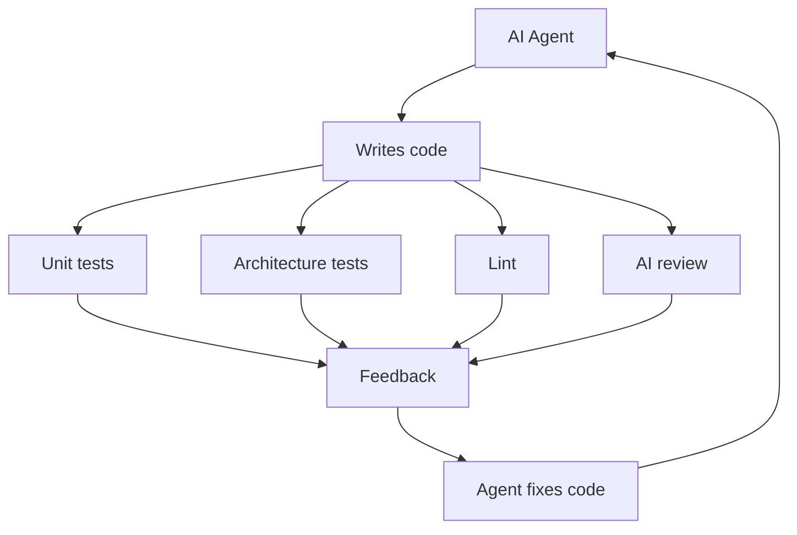
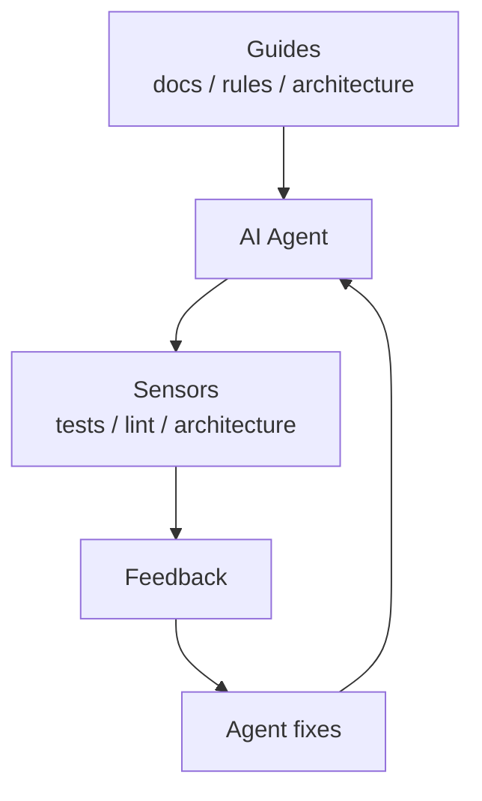
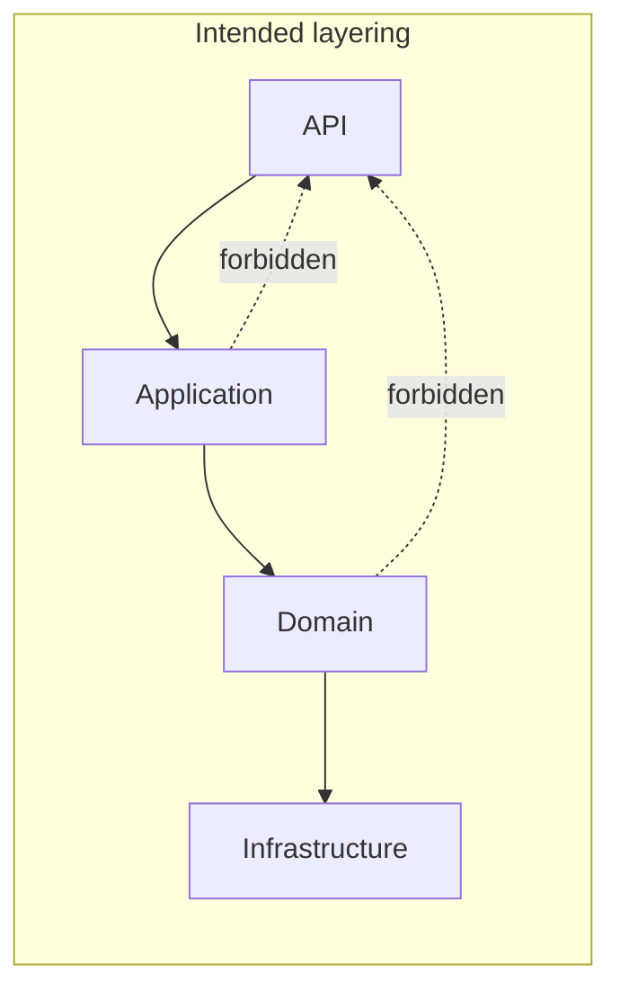
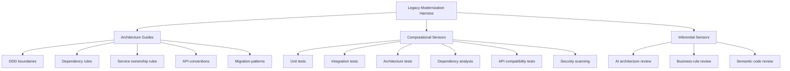
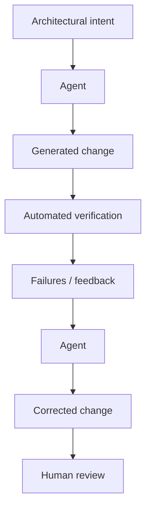
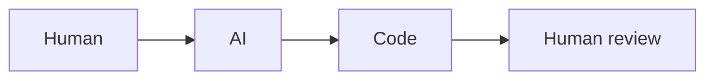
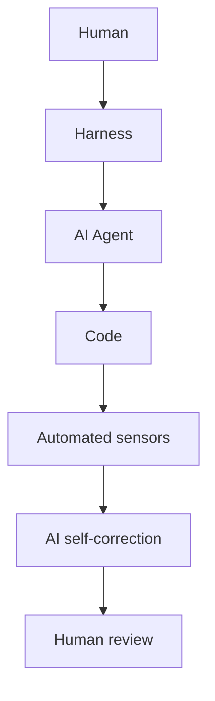

## TL;DR

**Harness engineering is about building everything *around* an AI coding agent that makes its output reliable.**

The key idea: **don't just make the AI smarter; build a better system around it.** The harness provides **guidance before the agent acts** and **feedback after it acts**, creating a continuous self-correction loop.

> [!INFO] The formula
> **Coding Agent = Model + Harness**

The harness is what helps overcome the fundamental problem with LLM-generated code: the model is non-deterministic, doesn't inherently know your system's context, and cannot reliably judge whether its own output is correct.

## 1. Guides + Sensors

The most important concept in the article is the distinction between **guides** and **sensors**.

### Guides = feedforward

Tell the agent **how it should work before it starts**. Examples: `AGENTS.md`, coding conventions, architecture documentation, reference implementations, skills/how-to instructions, project bootstrap scripts, code-generation tools, OpenRewrite/codemods, architectural rules.

> Goal: **prevent the agent from making mistakes in the first place.**

### Sensors = feedback

Check **what the agent actually produced**. Examples: unit tests, integration tests, linters, type checking, static analysis, architecture tests, browser tests, logs, AI code review.

> Goal: **detect mistakes and give the agent enough information to fix them itself.**

Fowler emphasizes you need **both**. Guides without sensors can't tell whether the rules actually worked; sensors without guides cause the agent to repeatedly make the same mistakes.

## 2. Computational vs. Inferential controls

Another key distinction is **how the harness evaluates the code**.

| Type              | Examples                                          | Characteristics                     |
| ----------------- | ------------------------------------------------- | ----------------------------------- |
| **Computational** | tests, linters, type checkers, static analysis    | deterministic, fast, cheap          |
| **Inferential**   | AI code review, LLM-as-judge, semantic analysis   | slower, expensive, probabilistic    |

Computational checks should generally run frequently because they're cheap and reliable. Inferential checks are useful for things that are difficult to express deterministically, such as: *"Does this implementation actually make conceptual sense?"*

## 3. The real goal: a self-correcting loop

The objective isn't necessarily *"AI writes perfect code."* Instead: **AI makes mistakes, but the surrounding system detects and corrects those mistakes automatically.** This is a much more realistic way to achieve reliable autonomous coding.

## 4. Three areas that need regulation

The harness needs to protect three dimensions of software quality.

### ① Maintainability

Prevent the agent from creating messy code: coding standards, duplication detection, naming conventions, complexity checks, refactoring rules, dead-code detection.

### ② Architecture fitness

Prevent the agent from gradually destroying the architecture. Architecture tests can enforce rules such as *Domain must not depend on Infrastructure* and *Application must not depend on API*. This matters especially with AI, because an agent can produce locally reasonable code that is **architecturally wrong**.

### ③ Behaviour

Does the software actually do what the business requires? This is the hardest area. Tests can verify many things but cannot completely capture *"Is this actually what the business wants?"* — that's where semantic/inferential sensors and ultimately human judgment become important.

## 5. "Harnessability"

A system should be designed so an AI agent can **observe, modify, and verify** it easily. A codebase is more harnessable if it has: good automated tests, clear architecture, machine-readable documentation, deterministic build processes, static analysis, clear module boundaries, easy local development, reliable CI, and good observability.

> [!TIP] Takeaway
> **AI doesn't eliminate the need for good software engineering. It makes good engineering infrastructure even more important.**

## 6. The role of humans changes

Humans don't disappear — their job shifts from *"write and review every piece of code"* toward *"design and improve the system that allows agents to write and verify code."*

Instead of repeatedly telling an agent *"don't put repository logic in the domain layer,"* you create an **architecture test** that automatically detects it. The next agent — and all future agents — benefit from the same rule.

> **Turn human knowledge into executable constraints and feedback mechanisms.**

## 7. The most interesting implication for software architects

Imagine an AI agent working on a legacy .NET monolith. Instead of just saying *"Extract the Order module into a microservice,"* you build a harness:

The workflow then becomes:

That is far more powerful than simply asking an LLM to *"modernize this legacy code."*

## The core message

> **The future of AI-assisted software development isn't primarily about giving agents better prompts; it's about engineering a reliable environment of guides, tools, tests, architectural constraints, and feedback loops around them.**

The most important architectural shift:

**Today**

**Harness engineering**

The harness **reduces the amount of human review required while increasing confidence in the result** — the central thesis of the article.

## References

- [Harness Engineering — Martin Fowler](https://martinfowler.com/articles/harness-engineering.html)
