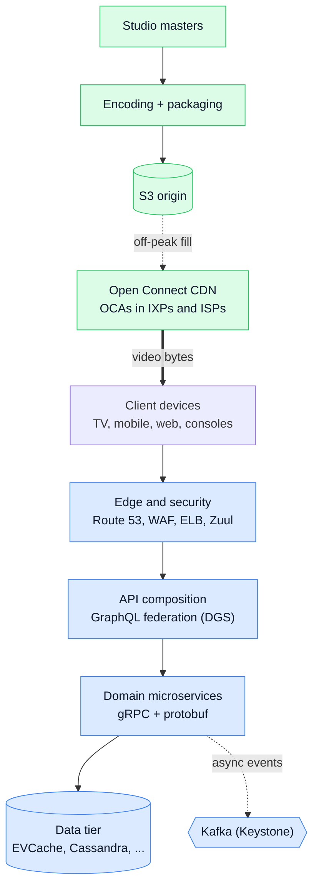
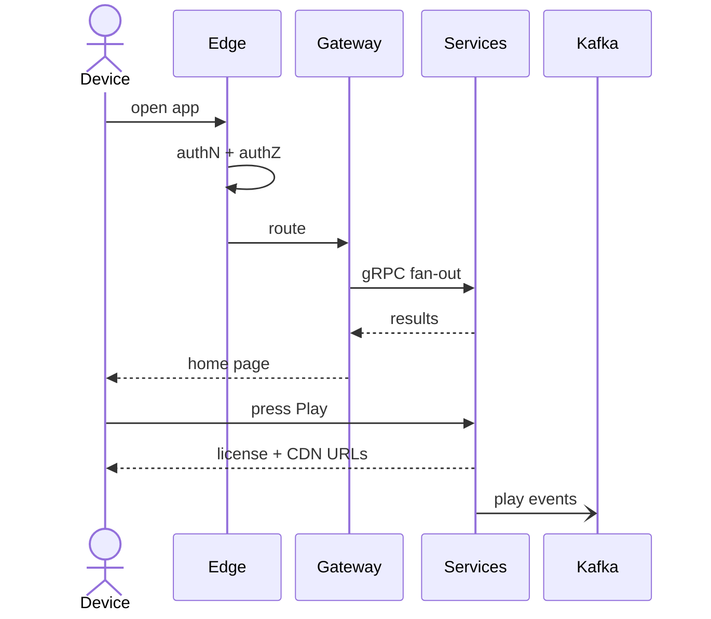
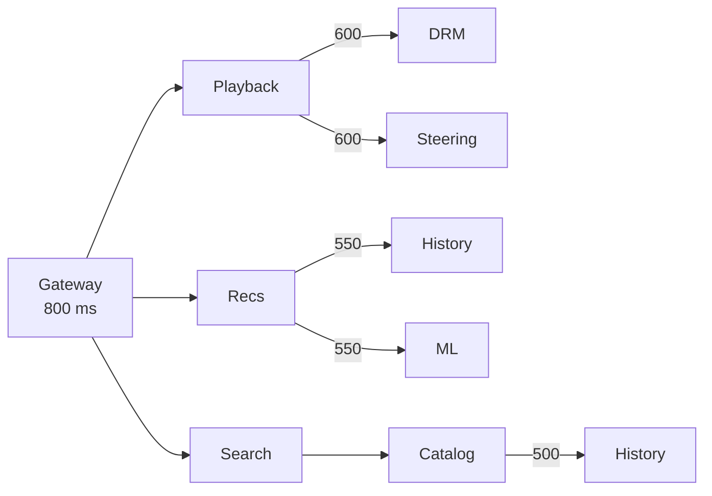
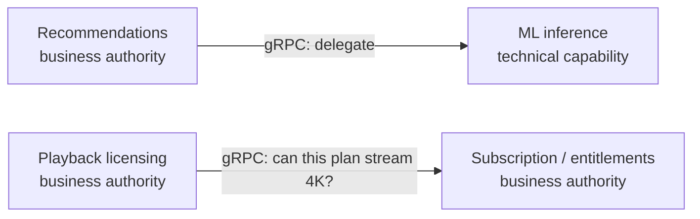
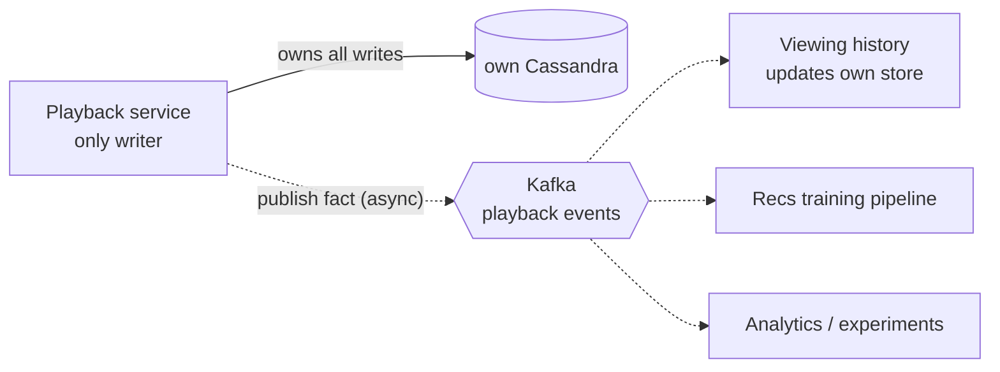
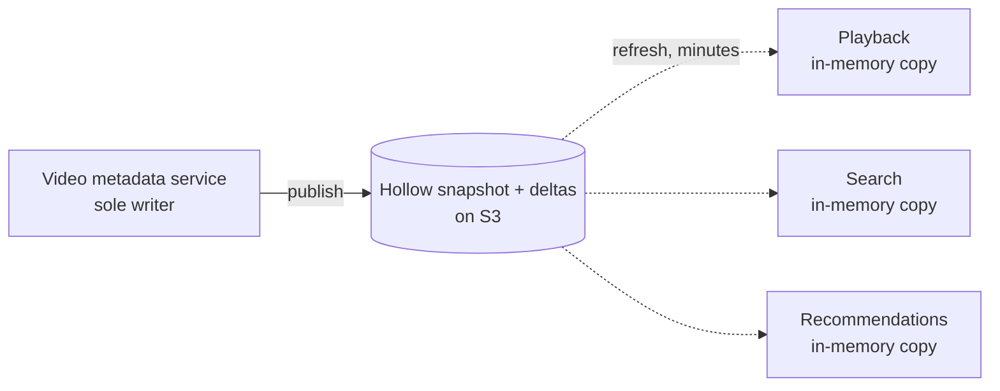
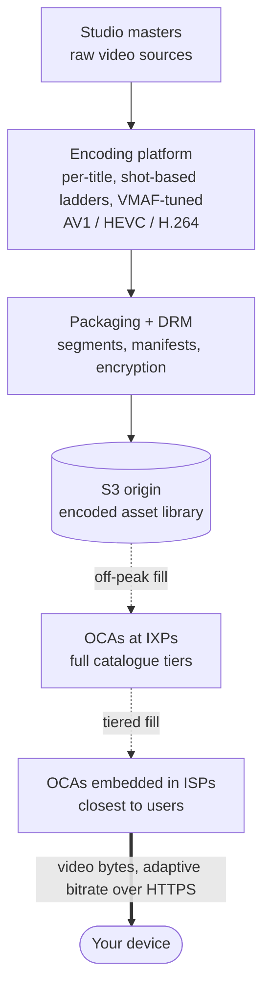

> [!NOTE] About this article
> It is based on a set of architecture diagrams (infrastructure, gRPC, system architecture and service interaction). Figures such as deadline budgets and the heartbeat interval are **as drawn** in those diagrams and may be simplified, so read them as illustrations of the design rather than official Netflix numbers.

## The big picture in one minute

The system splits cleanly in two:

- **Control plane (AWS).** Everything that decides *what* to play: sign-in, browsing, recommendations, search, licensing. It runs in 3+ AWS regions, active-active, across multiple availability zones.
- **Data plane (Open Connect).** Netflix's own CDN, which delivers essentially **all video bytes**. Video never flows through the AWS services above.

*Blue: control plane. Green: content and data plane.*

*The full infrastructure diagram. Click the image to enlarge.*

## What happens when you press play

| Step | What happens | Where |
| --- | --- | --- |
| 1 | DNS resolves to the nearest healthy region (latency- and failover-aware). | Route 53 |
| 2 | TLS passes through DDoS/WAF filtering and the load balancer to the API gateway, which validates the device token (**authN**) and mints an identity carried on every internal hop. | Shield/WAF, ELB, Zuul, Passport |
| 3 | Membership and entitlements are checked (**authZ**): plan, profile, region rights. | Membership service |
| 4 | The gateway routes to the GraphQL federated gateway, which composes the view for the device. | Zuul, DGS |
| 5 | The gateway fans out over **gRPC** to domain services, each call with a time budget (about 800 ms). | Playback, recommendations, catalog, search |
| 6 | Data reads go cache-first: EVCache, then Cassandra on a miss. Catalog metadata comes from local memory; search queries hit Elasticsearch. | Data tier |
| 7 | The composed response returns to the device (the home page renders). | Zuul |
| 8 | On **Play**, the playback service and CDN steering return a DRM license, a manifest and ranked Open Connect URLs. The device then streams video from the nearest OCA. | Playback, steering, Open Connect |
| 9 | Play and impression events are published to Kafka, asynchronously. History, training and analytics consume them. Nobody waits. | Kafka |
| 10 | Metrics, traces and logs flow continuously to the observability stack. | Atlas, Edgar, Mantis |

## The layers

| Layer | Components | Job |
| --- | --- | --- |
| **Edge and security** | Route 53, AWS Shield/WAF, ELB/NLB, Zuul | Geo/latency routing, DDoS and request filtering, zone-aware balancing, then the API gateway does TLS termination, dynamic routing, load shedding and canary/squeeze tests. |
| **Identity** | Passport / token service, membership and entitlements | Authenticates once at the edge and mints a token-agnostic identity that travels on every internal call. Entitlements decide what the plan allows. |
| **API composition** | GraphQL federation (DGS), one BFF per device family | Composes each device's view from many services. Each client type gets its own gateway (see [Backend for Frontend](/microservices/backend-for-frontend-bff/)). |
| **Domain microservices** | Hundreds of services, thousands of instances: identity, billing, recommendations, search, playback licensing, history, A/B testing, catalog, messaging, CDN steering | Each is the authority for one business capability, talking gRPC + protobuf. |
| **Platform / runtime** | Eureka, gRPC with client-side load balancing, circuit breakers, Titus containers, Spinnaker, Atlas, chaos tools | Discovery, resilience, hosting and deployment (red/black), telemetry, failure injection. |
| **Data tier** | EVCache, Cassandra, MySQL/CockroachDB, Elasticsearch, S3, Hollow, DynamoDB/KeyValue | Cache-first reads, each store chosen for its job. |
| **Event backbone** | Kafka (Keystone), Flink, SQS | Asynchronous events, stream processing, work queues. |
| **Observability** | Atlas, Edgar, Mantis, logging pipeline, alerting | Metrics, distributed tracing, real-time stream analysis, anomaly detection. |

**Data tier: right store for the job**

| Store | Role |
| --- | --- |
| **EVCache** (memcached) | Sub-millisecond cache, per-AZ replicas. Hit first. |
| **Cassandra** | Source of truth, multi-region. |
| **MySQL / CockroachDB** | Billing, where ACID matters. |
| **Elasticsearch** | Search index. |
| **S3** | Objects, data lake (Iceberg), backups. |
| **Hollow** | Catalog metadata replicated into each consumer's memory, so reads need zero RPC. |
| **DynamoDB / KeyValue** | Key-value use cases behind a common data-access layer. |

## Service-to-service: gRPC

Inside the control plane, services call each other over **gRPC** (HTTP/2 + protobuf). Every gRPC edge carries the same set of protections, in this order:

| # | Step | What it does |
| --- | --- | --- |
| 1 | Generated stub | A typed client generated from the `.proto` contract. |
| 2 | Deadline propagation | The **remaining time budget** travels downstream with the call. |
| 3 | Discovery | Resolves the instance list from a locally cached copy of the Eureka registry. |
| 4 | Client-side load balancer | Zone-aware instance choice, with no central load balancer in the path. |
| 5 | Circuit breaker + retry budget | Fail fast and use a fallback when a dependency is unhealthy. |
| 6 | HTTP/2 channel | One connection, multiplexed streams, protobuf frames. |

**Discovery** works by every instance registering with the Eureka cluster and sending a heartbeat (about every 30 seconds). Clients cache the instance list locally, so a registry hiccup does not stop calls.

**Deadline propagation** is the key idea for keeping tail latency under control. The gateway starts with a budget and each hop passes on only what is left:

Numbers on the arrows are the milliseconds left in the budget. A service deep in the chain knows it must answer quickly, or not at all, instead of working on a response nobody is waiting for.

> [!TIP] The async contrast
> Kafka is **not** part of the gRPC path. Play events, impressions and history writes go through it asynchronously, and pipelines and other services consume them.

## Three ways services interact

Not every dependency is handled the same way. The diagram set distinguishes three patterns, and it separates two axes that are often confused:

| Axis | Question | When it is decided |
| --- | --- | --- |
| **Authority** | Who may decide and change this data? | Design time |
| **Coupling** | Whose failure or latency can hurt me? | Run time |

A synchronous call **always** adds coupling. It touches authority only when *both* ends are business capabilities.

### Pattern 1: synchronous gRPC, two different cases

| Case | Example | Verdict |
| --- | --- | --- |
| **A. Business to technical** | Recommendations calls an ML inference service. | Uncontroversial anywhere. The inference service holds no business authority to violate, so only coupling needs managing. |
| **B. Business to business** | Playback licensing asks entitlements "can this plan stream 4K right now?" | The genuine tension. The purist fix is to **replicate** entitlements through events. Synchronous calls survive where the data resists replication: too fresh, needed per request, or must be authoritative at decision time. |

Either way, every synchronous edge wears **armour**: a deadline, a circuit breaker and a fallback. That pays the coupling cost. It says nothing about authority.

> [!INFO] The same debate, in depth
> Case B is exactly the question examined in [Service-to-Service Synchronous Communication Pitfall](/microservices/service-to-service-synchronous-communication-pitfall/), which argues that calls across bounded contexts should be replaced by ownership, replication or orchestration.

### Pattern 2: writes and side effects, strict authority plus events

One service is the only writer of its data. It publishes **facts, not commands**, and others build their own views:

- **Authority:** strict. **Coupling at run time:** none.
- The producer neither knows nor cares who consumes.
- Consumers build their own views, so consistency is eventual (seconds).
- If a consumer is down, events queue up and users notice nothing.
- No deadline or circuit breaker is needed, because nobody is waiting.

### Pattern 3: hot, stable reference data is replicated, not queried

Catalog metadata is read constantly by many services and changes slowly. Instead of calling the metadata service, each consumer keeps a copy in memory using **Hollow**:

- **Authority:** strict. **Coupling:** eliminated, with no runtime call on the hot path.
- It works because the data is read-heavy, shared and slow-changing.
- The trade: staleness of minutes, and memory used in every consumer.
- The same fix applies to Case B data such as entitlements, when the freshness tolerance allows.

## Getting the video to you

Content follows a separate pipeline that never touches the microservices:

- **Encoding** produces hundreds of versions of each title, so the player can adapt to network conditions.
- **Open Connect appliances (OCAs)** sit at internet exchange points and inside ISP networks, and are filled during off-peak hours from the S3 origin.
- **Proactive placement:** the Open Connect control plane orchestrates fill, health and content placement, using popularity prediction.
- **Steering:** when you press play, the CDN steering service authorises the request and points your device at the nearest healthy OCA.

## Takeaways for architects

1. **Separate the control plane from the data plane.** Decisions run on flexible cloud services. The heavy bytes ride a purpose-built network.
2. **Authenticate once, at the edge.** Mint a token-agnostic identity and propagate it on every internal call.
3. **Compose per device.** A federated GraphQL gateway (a BFF per device family) keeps clients simple and services generic.
4. **Give every synchronous call a deadline, a breaker and a fallback.** Propagate the remaining budget so slow paths fail fast.
5. **Choose the interaction style per dependency.** Delegation to a technical service: gRPC. Side effects: events. Hot, stable reference data: replicate it.
6. **Keep authority and coupling apart.** They are different questions with different answers.
7. **Invest in observability from the start.** Metrics, tracing and real-time analysis are part of the platform, not an afterthought.

## References

Further reading on the open-source and platform pieces named above:

- [Netflix Technology Blog](https://netflixtechblog.com/)
- [Open Connect — Netflix](https://openconnect.netflix.com/)
- [Netflix/eureka](https://github.com/Netflix/eureka) — service discovery
- [Netflix/zuul](https://github.com/Netflix/zuul) — API gateway
- [Netflix/hollow](https://github.com/Netflix/hollow) — in-memory dataset replication
- [Netflix/dgs-framework](https://github.com/Netflix/dgs-framework) — GraphQL federation (DGS)
- [Netflix/EVCache](https://github.com/Netflix/EVCache) — distributed caching
- [Netflix/atlas](https://github.com/Netflix/atlas) — dimensional time-series metrics
- [Netflix/titus](https://github.com/Netflix/titus) — container platform
- [Spinnaker](https://spinnaker.io/) — continuous delivery
