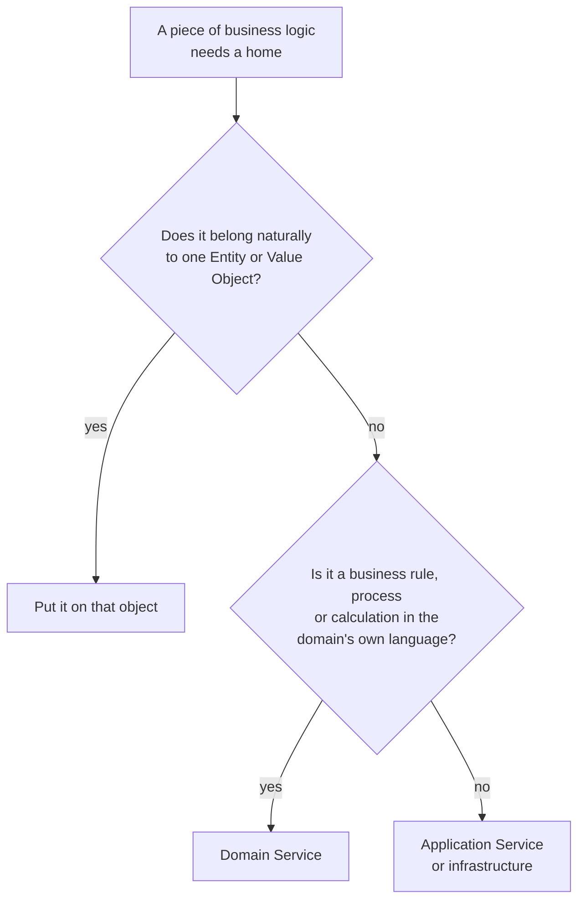
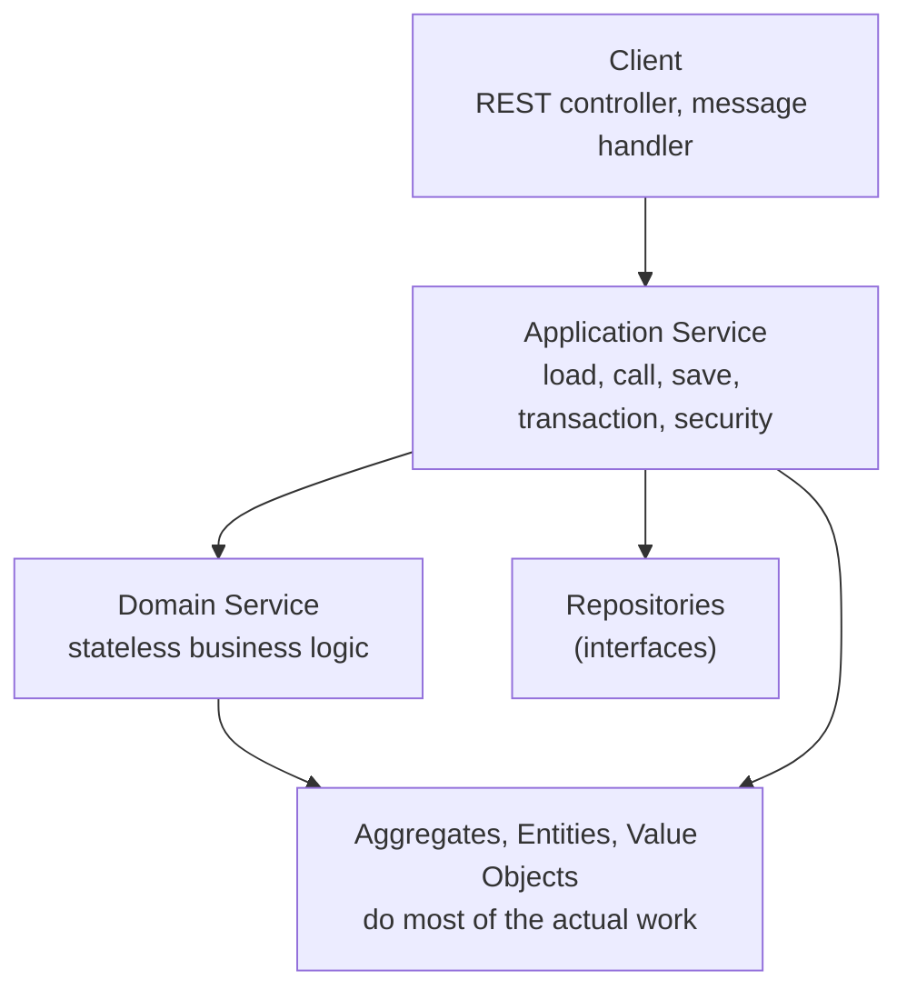

> [!TIP] The short version
> A **Domain Service** is a **stateless** operation in the domain model that holds genuine business logic which doesn't naturally belong to any single Entity or Value Object. Use it only when an operation spans several Aggregates, or would be clumsy to put on any one object. Otherwise the logic belongs on the object.
>
> It is **not** a coarse-grained SOA/RPC endpoint, and it is **not** an Application Service.

## What it is, and what it isn't

Domain-Driven Design gives you several things that are all called "service". They live in different places and do different jobs:

| | Holds | State | Speaks | Example |
| --- | --- | --- | --- | --- |
| **Entity / Value Object** | Behaviour that belongs to one concept | Yes | Ubiquitous Language | `order.addItem(...)` |
| **Domain Service** | Business logic that belongs to **no single** object | **No** | Ubiquitous Language | `consolidate(source, target)` |
| **Application Service** | Coordination: load, call, save, transaction, security | No | Use cases | `consolidateOrders(command)` |
| **SOA / RPC service** | A deployable, network-facing endpoint | n/a | An API | `POST /orders/consolidate` |

Two things to keep straight:

- A Domain Service is an **object in the domain layer**, not a deployable. Don't confuse it with a *microservice*. A bounded context may contain many Domain Services and many microservices.
- Eric Evans's test for telling the two service kinds apart: exporting transactions to a spreadsheet is an **Application** service, because file formats mean nothing in the business and involve no business rules. **Transferring funds** between two accounts is a **Domain** service, because it embeds real rules (crediting and debiting the right accounts) and "funds transfer" is a meaningful banking concept. Even then the service does little itself. It asks the two `Account` objects to do most of the work.

### Evans's three characteristics

A good Domain Service satisfies all three:

1. The operation relates to a domain concept that is **not a natural part of an Entity or Value Object**.
2. Its interface is defined in terms of **other elements of the domain model**.
3. The operation is **stateless**.

## When to use one: three cases

Vaughn Vernon names the situations where a Domain Service earns its place:

| # | Use a Domain Service to... | Example in this article |
| --- | --- | --- |
| 1 | **Perform a significant business process** | Consolidating two draft orders into one |
| 2 | **Transform a domain object from one composition to another** | Translating another context's customer message into a `Payer` |
| 3 | **Calculate a value that needs input from more than one domain object or Aggregate** | Working out a payment's processing fee |



The order of those questions matters. **Try the object first.** A Domain Service is the second choice, not the first.

## The rules of a good Domain Service

- **Stateless.** It holds no data of its own between calls, only algorithms.
- **Named in the Ubiquitous Language** of its Bounded Context. Prefer `authenticate(...)` on an authentication service over a client asking a `User` whether it `isAuthentic()`.
- **Its interface belongs in the domain layer.** Its implementation usually does too, unless it needs infrastructure.
- **Its natural client is an Application Service**, which only *coordinates* the call.
- **All domain knowledge stays inside.** Checking that a tenant is active or encrypting a password happens in the service, never in the client.
- **It returns small, safe Value Objects** rather than full Entities, so callers get only what they need.



> [!NOTE] About the code
> The Java below is converted from the C# examples in the [OpenMind.DDD.Patterns](https://github.com/tung-le-lv/OpenMind.DDD.Patterns) repository (`OrderConsolidationService` and `PaymentProcessingService`), with one extra example for the transformation case and Vernon's authentication example. Small supporting types (`Money`, `Order`, the repositories) are only sketched. The services and their clients were compiled and run against tests of their rules. The blocks marked ANTI-PATTERN and the unit-test snippet are illustrations.

All the services share a marker interface, exactly like the repo's `IDomainService`:

```java
// shared/DomainService.java
public interface DomainService { }

// shared/DomainException.java
public class DomainException extends RuntimeException {
    public DomainException(String message) { super(message); }
}
```

## Case 1: a significant business process

**Consolidate two draft orders into one.** Neither `Order` can own this logic, because neither aggregate has authority over the other. The rules span both: same customer, same currency, both still drafts, and a combined item limit. This mirrors Evans's funds-transfer example: two objects, one global rule set.

```java
// order/domain/service/OrderConsolidationService.java
public interface OrderConsolidationService extends DomainService {
    /** Moves every item of source into target, then cancels source. */
    void consolidate(Order source, Order target);
}
```

```java
// order/domain/service/DefaultOrderConsolidationService.java
public class DefaultOrderConsolidationService implements OrderConsolidationService {

    private static final int MAX_ITEMS_PER_ORDER = 100;

    @Override
    public void consolidate(Order source, Order target) {
        enforceInvariants(source, target);           // cross-aggregate rules live here

        for (OrderItem item : source.items()) {      // the Order objects do the real work
            target.addItem(item.productId(), item.productName(), item.unitPrice(), item.quantity());
        }
        source.cancel("Consolidated into order " + target.id());
    }

    private static void enforceInvariants(Order source, Order target) {
        if (!source.customerId().equals(target.customerId()))
            throw new DomainException("Cannot consolidate orders belonging to different customers.");
        if (source.status() != OrderStatus.DRAFT || target.status() != OrderStatus.DRAFT)
            throw new DomainException("Both orders must be in Draft status to consolidate.");
        if (!source.currency().equals(target.currency()))
            throw new DomainException("Cannot consolidate orders with different currencies.");
        if (source.items().size() + target.items().size() > MAX_ITEMS_PER_ORDER)
            throw new DomainException("Consolidation would exceed the maximum of "
                    + MAX_ITEMS_PER_ORDER + " items per order.");
    }
}
```

The client is an **Application Service**. Look at how little it does: it doesn't know a single business rule.

```java
// order/application/OrderApplicationService.java
public class OrderApplicationService {
    private final OrderRepository orders;
    private final OrderConsolidationService consolidation;

    public OrderApplicationService(OrderRepository orders, OrderConsolidationService consolidation) {
        this.orders = orders;
        this.consolidation = consolidation;
    }

    // @Transactional: the application service owns the transaction boundary
    public void consolidateOrders(ConsolidateOrdersCommand command) {
        Order source = orders.getById(command.sourceOrderId());
        Order target = orders.getById(command.targetOrderId());

        consolidation.consolidate(source, target);   // all business rules are in the domain service

        orders.save(source);
        orders.save(target);
    }
}
```

## Case 2: transform one composition into another

**Translate another context's customer into a `Payer`.** The Customer context publishes `CustomerDetailsChanged`, in its own language. The Payment context has its own concept of the same person: a **Payer**, with only what payment needs. Turning one into the other is a domain rule ("a payer needs a valid email and a complete billing address"), so it belongs in a Domain Service in the *downstream* (Payment) context. This is the translation role of an Anticorruption Layer.

```java
// customer context, published language (input)
public record CustomerDetailsChanged(String customerId, String fullName, String email,
                                     String addressLine, String city, String postalCode, String country) { }

// payment/domain: the Payment context's own model (output)
public record BillingAddress(String line, String city, String postalCode, String country) { }
public record Payer(String customerId, String name, String email, BillingAddress billingAddress) { }
```

```java
// payment/domain/service/PayerService.java
public interface PayerService extends DomainService {
    Payer payerFrom(CustomerDetailsChanged customer);
}
```

```java
// payment/domain/service/DefaultPayerService.java
public class DefaultPayerService implements PayerService {

    @Override
    public Payer payerFrom(CustomerDetailsChanged customer) {
        if (isBlank(customer.fullName()))
            throw new DomainException("A payer needs a name.");
        if (isBlank(customer.email()) || !customer.email().contains("@"))
            throw new DomainException("A payer needs a valid email address.");
        if (isBlank(customer.addressLine()) || isBlank(customer.city()) || isBlank(customer.postalCode()))
            throw new DomainException("A payer needs a complete billing address.");
        if (customer.country() == null || customer.country().trim().length() != 2)
            throw new DomainException("Country must be a two-letter ISO code.");

        BillingAddress address = new BillingAddress(
                customer.addressLine().trim(), customer.city().trim(),
                customer.postalCode().trim(), customer.country().trim().toUpperCase());

        return new Payer(customer.customerId(), customer.fullName().trim(),
                customer.email().trim().toLowerCase(), address);
    }

    private static boolean isBlank(String value) { return value == null || value.isBlank(); }
}
```

The client is again an Application Service, here an event handler. It keeps a **local projection** of payers, so Payment never has to call the Customer context synchronously (see [the synchronous call pitfall](/microservices/service-to-service-synchronous-communication-pitfall/)).

```java
// payment/application/CustomerDetailsChangedHandler.java
public class CustomerDetailsChangedHandler {
    private final PayerService payers;
    private final PayerRepository repository;

    public CustomerDetailsChangedHandler(PayerService payers, PayerRepository repository) {
        this.payers = payers;
        this.repository = repository;
    }

    public void handle(CustomerDetailsChanged event) {
        repository.save(payers.payerFrom(event));   // translate, then store
    }
}
```

## Case 3: calculate a value from several objects

**Work out a payment's processing fee.** The fee depends on the amount (a `Money`) *and* the `PaymentMethod`. Neither owns the other's rules, and the rate table is business knowledge, so it sits in a Domain Service. The same service also holds two related domain checks: is this payment processable, and does it need extra verification?

```java
// payment/domain/service/PaymentProcessingService.java
public interface PaymentProcessingService extends DomainService {
    PaymentValidationResult validatePayment(Payment payment);
    Money calculateProcessingFee(Money amount, PaymentMethod method);
    boolean requiresAdditionalVerification(Payment payment, BigDecimal threshold);
}

public record PaymentValidationResult(boolean valid, String errorMessage) {
    public static PaymentValidationResult success() { return new PaymentValidationResult(true, null); }
    public static PaymentValidationResult failure(String message) { return new PaymentValidationResult(false, message); }
}
```

```java
// payment/domain/service/DefaultPaymentProcessingService.java
public class DefaultPaymentProcessingService implements PaymentProcessingService {

    private static final BigDecimal HIGH_VALUE_THRESHOLD = new BigDecimal("1000");

    @Override
    public PaymentValidationResult validatePayment(Payment payment) {
        if (payment.amount().amount().signum() <= 0)
            return PaymentValidationResult.failure("Payment amount must be positive");
        if (payment.cardDetails() != null && payment.cardDetails().isExpired())
            return PaymentValidationResult.failure("Card has expired");
        if (payment.status() != PaymentStatus.PENDING)
            return PaymentValidationResult.failure("Payment cannot be processed in " + payment.status() + " status");
        return PaymentValidationResult.success();
    }

    @Override
    public Money calculateProcessingFee(Money amount, PaymentMethod method) {
        BigDecimal feeRate = switch (method) {
            case CREDIT_CARD   -> new BigDecimal("0.029");
            case DEBIT_CARD    -> new BigDecimal("0.015");
            case PAYPAL        -> new BigDecimal("0.034");
            case BANK_TRANSFER -> new BigDecimal("0.005");
            default            -> new BigDecimal("0.03");
        };
        // Money rounds to two decimal places (HALF_UP)
        return new Money(amount.amount().multiply(feeRate), amount.currency());
    }

    @Override
    public boolean requiresAdditionalVerification(Payment payment, BigDecimal threshold) {
        return payment.amount().amount().compareTo(threshold) >= 0;
    }

    public boolean requiresAdditionalVerification(Payment payment) {
        return requiresAdditionalVerification(payment, HIGH_VALUE_THRESHOLD);
    }
}
```

A Domain Service has no infrastructure dependencies, so it is trivial to unit-test. There is nothing to mock:

```java
@Test
void creditCardFeeIsTwoPointNinePercent() {
    var service = new DefaultPaymentProcessingService();

    Money fee = service.calculateProcessingFee(Money.of("100.00", "USD"), PaymentMethod.CREDIT_CARD);

    assertEquals(Money.of("2.90", "USD"), fee);
}
```

## A reference example: authentication

Vernon's own illustration is an identity and access context. The service is called `authenticate`, which is Ubiquitous Language, and the *domain knowledge* stays hidden inside it: that an inactive tenant can't sign in, and how passwords are checked. It returns a small `UserDescriptor`, not the whole `User` entity.

```java
// identity/domain/service/AuthenticationService.java
public interface AuthenticationService extends DomainService {
    Optional<UserDescriptor> authenticate(TenantId tenantId, String username, String plainTextPassword);
}

// a small, safe Value Object: only what callers need
public record UserDescriptor(TenantId tenantId, String username, String emailAddress) { }
```

```java
// identity/domain/service/DefaultAuthenticationService.java
public class DefaultAuthenticationService implements AuthenticationService {
    private final TenantRepository tenants;
    private final UserRepository users;
    private final PasswordHasher hasher;

    public DefaultAuthenticationService(TenantRepository tenants, UserRepository users, PasswordHasher hasher) {
        this.tenants = tenants;
        this.users = users;
        this.hasher = hasher;
    }

    @Override
    public Optional<UserDescriptor> authenticate(TenantId tenantId, String username, String plainTextPassword) {
        if (tenantId == null || username == null || username.isBlank()
                || plainTextPassword == null || plainTextPassword.isBlank())
            return Optional.empty();

        return tenants.tenantOfId(tenantId)
                .filter(Tenant::isActive)                                                // domain knowledge
                .flatMap(tenant -> users.userWithUsername(tenantId, username))
                .filter(User::isEnabled)
                .filter(user -> hasher.matches(plainTextPassword, user.passwordHash()))  // details hidden
                .map(User::toDescriptor);                                                // a Value Object out
    }
}
```

Returning an empty `Optional` for every failure (unknown tenant, wrong password, disabled user) also avoids telling an attacker *why* sign-in failed.

The Application Service only passes the call through:

```java
// identity/application/IdentityApplicationService.java
public class IdentityApplicationService {
    private final AuthenticationService authentication;

    public IdentityApplicationService(AuthenticationService authentication) {
        this.authentication = authentication;
    }

    public Optional<UserDescriptor> authenticateUser(AuthenticateUserCommand command) {
        return authentication.authenticate(new TenantId(command.tenantId()),
                command.username(), command.password());
    }
}
```

Compare it with a client that has to know the rules. The tenant check and the password handling have leaked out of the model:

```java
// ANTI-PATTERN: domain knowledge scattered across clients
Tenant tenant = tenantRepository.tenantOfId(tenantId).orElseThrow();
if (!tenant.isActive()) return Optional.empty();              // every client must remember this
String encrypted = passwordEncoder.encode(password);          // and this
User user = userRepository.userWithUsername(tenantId, username).orElseThrow();
if (user.isAuthentic(encrypted)) { /* ... */ }                // and ask the entity to judge itself
```

## The trade-off: don't overuse it

> [!WARNING] The Anemic Domain Model
> It is tempting to reach for a service whenever logic feels awkward to place. If you lean on services for logic that belongs on Entities and Value Objects, all the behaviour drains out of the objects into procedural services. The objects become bags of getters and setters, and you have an **Anemic Domain Model**: the classic DDD anti-pattern.

```java
// ANTI-PATTERN: a service that steals the Order's own behaviour
public class OrderService {
    public void addItem(Order order, Product product, int quantity) {
        if (order.getStatus() != OrderStatus.DRAFT) throw new IllegalStateException();
        order.getItems().add(new OrderItem(product, quantity));
        order.setTotal(order.getTotal().add(product.getPrice().multiply(quantity)));
    }
}

// BETTER: the behaviour and its invariants live on the aggregate
order.addItem(productId, productName, unitPrice, quantity);
```

| Smell | Likely fix |
| --- | --- |
| The service only reads getters and calls setters on one object. | Move the logic onto that object. |
| Every entity is a data holder; all rules are in `*Service` classes. | Rebuild behaviour on the entities and Value Objects. |
| The "service" is really orchestration: loading, saving, sending. | It is an **Application** Service. |
| The service has fields that change between calls. | It is not stateless, so it is not a Domain Service. |
| The operation touches only one Aggregate. | It probably belongs on that Aggregate. |

## Why it matters

Used sparingly, a Domain Service keeps your **clients thin and the model rich**. The rules that span several objects have one named, testable home in the Ubiquitous Language, instead of being scattered across controllers and handlers. Used carelessly, it hollows out your entities. The discipline is simple: **object first, Domain Service second, and never a substitute for behaviour that belongs on a single object.**

## References

- Eric Evans, *Domain-Driven Design: Tackling Complexity in the Heart of Software* (Addison-Wesley, 2003) — Chapter 5, Services.
- Vaughn Vernon, *Implementing Domain-Driven Design* (Addison-Wesley, 2013) — Chapter 7, Services.
- [OpenMind.DDD.Patterns](https://github.com/tung-le-lv/OpenMind.DDD.Patterns) — C# examples that the Java above is converted from.
