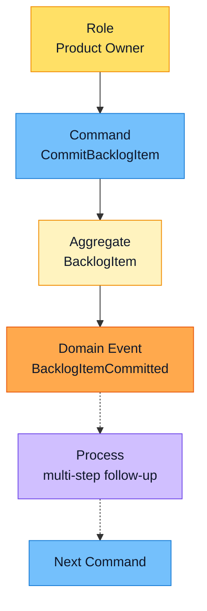
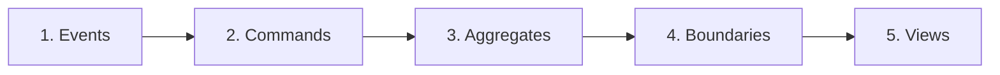

> [!TIP] Two levels of storming
> You can use Event Storming for both **big-picture** and **design-level** modelling. Big-picture storming is less precise. Design-level storming leads you towards concrete software artifacts, such as aggregates and commands.

## The sticky-note vocabulary

Everything on the modelling surface is a coloured sticky note. Each colour means one thing, which is what lets business people and developers read the same wall.

| Note | Colour | What it is |
| --- | --- | --- |
| **Domain Event** | Orange | A verb in the **past tense**, for example `ProductCreated`. The foundation of the process. |
| **Command** | Blue | An **imperative** verb, for example `CreateProduct` or `CommitBacklogItem`, that triggers a Domain Event. |
| **Aggregate** | Pale yellow | The entity or data holder where commands execute. |
| **Role** | Yellow | A specific user type, for example *Product Owner*, who starts an action. It is placed on a Command. |
| **Process** | Lilac | A complex, multi-step operation triggered by an event or a command. |
| **Hotspot** | Rose | A trouble spot, bottleneck or conflict in the current business process that needs further investigation. |

They chain together like this:

*A Role issues a Command. The Command runs on an Aggregate, which produces a Domain Event. An event can in turn trigger a Process or another Command.*

## Step by step

### 1. Storm out the business process with Domain Events

Start by writing a series of **Domain Events** on sticky notes and laying them out along the process. Orange is the most popular colour for Domain Events, because it makes them stand out most prominently on the modelling surface.

### 2. Create the Commands that cause each Domain Event

Now ask what causes each event. Sometimes a Domain Event is the outcome of something that happened in **another system**, and it flows into your system as a result. More often, a Command is the outcome of a **user gesture**, and carrying out that Command causes the Domain Event.

State each Command in the imperative: `CreateProduct`, `CommitBacklogItem`.

### 3. Associate the Entity or Aggregate

Next, find the Entity/Aggregate on which the Command is executed and which produces the Domain Event. This is the data holder where Commands are executed and Domain Events are emitted.

> [!WARNING] Don't start with the data model
> Entity relationship diagrams are often the first and most popular step in today's IT world, but it is a big mistake to start here. Business people don't understand them well, and they can shut down the conversation quickly.
>
> That is why this step is **third** in Event Storming: the focus is the business process, not the data. Even so, we do need to think about data at some point, and this is that point. By now, business experts will likely see how the data comes into play.

### 4. Draw boundaries and arrows to show the flow

Draw boundaries and lines with arrows to show flow across the modelling surface. You will very likely find that there are **multiple models** in play, and Domain Events that flow between them. Those seams are candidates for Bounded Contexts (see [Identifying Bounded Contexts](/domain-driven-design/identifying-bounded-contexts/)).

### 5. Identify the views and the roles

Finally, identify the various **views** your users need to carry out their actions, and the important **roles** of the different users.

## References

- Vaughn Vernon, *Domain-Driven Design Distilled* (Addison-Wesley, 2016).
