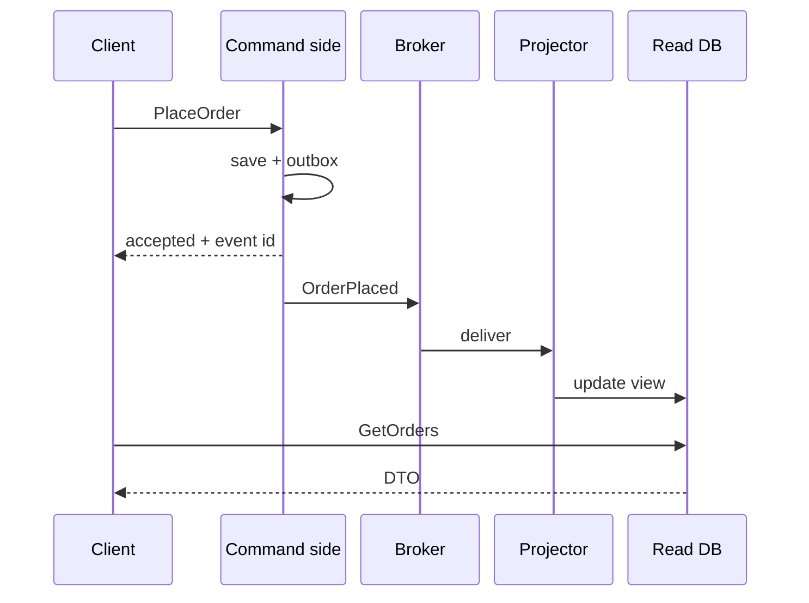
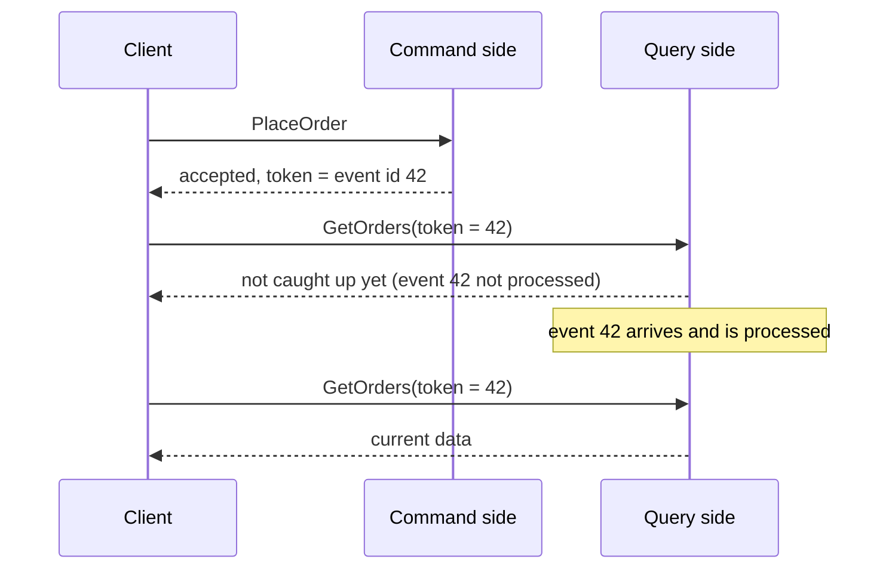
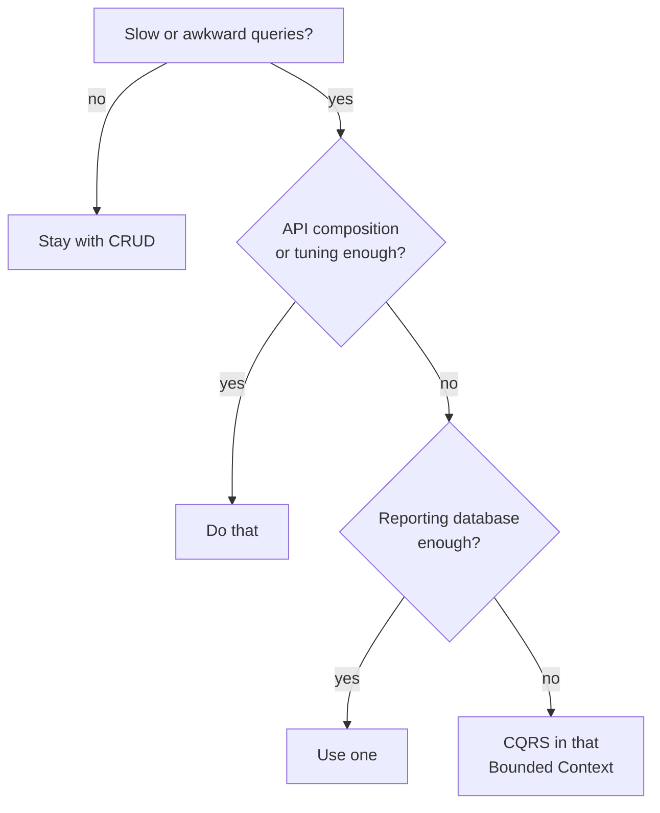

> [!TIP] The short version
> **CQRS** (Command Query Responsibility Segregation) means using **a different model to update information than the model you use to read it**. Commands change state. Queries return data and never change anything.
>
> It is a powerful tool and an easy one to misuse. **Most systems do not need it.** Reach for it only for a specific part of a system (one Bounded Context) where reads and writes really pull in different directions.

## What CQRS is

The mainstream way to work with an information system is **CRUD**: one record structure that you create, read, update and delete. In the simplest case, all interaction is about storing and retrieving those records.

As needs grow, that model strains. We want to look at the data differently from how it is stored: collapse several records into one, or build virtual records from several places. On the update side we add validation rules, or even infer data that differs from what the user typed. Users then see many *presentations* of the data, and a single conceptual model has to serve all of them.

CQRS changes one thing: it **splits that conceptual model into two**, one for **updates (commands)** and one for **display (queries)**. The names come from *Command Query Separation*: a method either changes state (a command) or returns data (a query), never both. The reasoning is that for many problems, especially in complicated domains, one shared model ends up complex and does neither job well. The pattern was first described by Greg Young.


| | **Command side** | **Query side** |
| --- | --- | --- |
| **Purpose** | Create, update, delete | Read |
| **Contains** | The domain model and business rules | No business rules, just data shaped for the screen |
| **Returns** | Nothing useful (perhaps an id or a token) | DTOs, never domain objects |
| **Data model** | Optimised for updates | Optimised for the queries it serves |
| **Changes data?** | Yes | **Never** |

**Separate models** usually means different object models, possibly in different processes or on different hardware. They can share one database, in which case the database is the link between them. Or they can use separate databases, so the query side becomes in effect a real-time reporting database, and then some mechanism must keep the two in sync.

## The problems it solves

CQRS is a response to specific pain, not a default style. These are the problems people run into.

### 1. Joining large datasets across services

In a microservice system, data is scattered. A query such as "all of a consumer's orders, with their delivery and payment status" needs data from the Order, Kitchen, Delivery and Accounting services. The **API composition** pattern fetches from each and joins in memory. For large datasets that is slow and expensive, because the composer re-implements the work of a database's query engine.


A CQRS view that **pre-joins** the data from several services answers the same query with one indexed read.

### 2. The data isn't stored in a form the query can use

Trying to support every query from one data model is often hard, and sometimes impossible. Some NoSQL databases have very limited querying. Even when a database has extensions for one kind of query, a specialised store is often better. CQRS lets you define **one or more views**, each in whatever store suits its queries. There may even be several read models, one per kind of query.

### 3. The service that owns the data shouldn't own the query

Consider the Restaurant Service. Its team's job is to let restaurant managers maintain their restaurants. A high-volume, critical `findAvailableRestaurants()` query is a very different concern. If the same team owned it, they would live in fear of shipping a change that stopped consumers ordering. It makes more sense for the Restaurant Service to publish its data and let **another service**, probably the Order team's, keep a view and serve that query.

### 4. One model that does too much

In a traditional layered application the same model serves both sides:

- On the **read** side, many different queries return DTOs of different shapes, and the mapping becomes complicated.
- On the **write** side, the model carries validation and business logic, so it grows into an overly complex model that does too much.
- **Read and write workloads are asymmetrical**, with very different performance and scaling needs.
- The read and write representations differ, for example extra columns that must be kept right even though the operation doesn't need them.
- **Data contention** appears when operations run in parallel on the same data.
- **Security and permissions** get complicated, because each entity is exposed to both reads and writes.

## How it works

### Commands

- **Task-based, not data-centric.** "Book hotel room", not "set `ReservationStatus` to `Reserved`". This may change the UI too: guide users through steps instead of a generic edit form.
- **Validate early.** Run checks on the client before sending, and disable buttons with an explanation ("no rooms left"). Then a server-side failure is usually only a race, such as two users booking the last room, and even that can be handled with more logic (a waiting list).
- **They may be queued** and processed asynchronously instead of synchronously.
- The command side handles create, update and delete. It may also serve simple queries, such as a primary-key lookup with no joins.

### Queries

- **Never modify the database.**
- Return a **DTO** that carries no domain knowledge.
- The query side is much simpler than the command side, because it does not implement business rules.
- It uses **whatever store suits the query**: a relational replica, a document database, a search index, or JSON in a cache. It can hold a **materialised view**, a denormalised copy that avoids joins.

### Keeping the two sides in sync

The command side publishes a **domain event** whenever its data changes. The query side has **event handlers** that subscribe to those events and update its views. Publishing reliably is a problem of its own, because a database and a broker cannot share one transaction. See [Transaction Messaging (Outbox)](/event-driven-architecture/transaction-messaging-outbox/).



## The four types of CQRS

CQRS is not a yes/no choice. There is a range between "no separation" and "complete separation", and each step adds power and cost.


| Type | What is separated | Gain | Cost | Good for |
| --- | --- | --- | --- | --- |
| **0. No CQRS** | Nothing. Domain classes serve commands and queries. | No extra code. | Queries load whole domain objects (for example every order, when the screen needs only a count). | Small apps with few performance needs. |
| **1. Separated classes** | Read **DTOs** apart from domain classes. Same database. | Clean, explicit read shapes. Freedom to use plain SQL or a light ORM for hot queries. | Some duplication: each concept is written twice. | **Most enterprise applications.** A good balance of complexity and performance. |
| **2. Separated model and API** | Read logic moves out of the repository into **query handlers** with their own API. | Optimised queries. Read API can be cached, put on another server, or load-balanced. | More code. | A heavy read workload. |
| **3. Separated storage** | A separate **read database** built for the queries, fed by events. | The most read scalability (search index, document store, replicas). | The most overhead: two databases and eventual consistency. | Massive read/write disparity. What many people mean by "true CQRS". |

> [!IMPORTANT] Stop as early as you can
> There is nothing wrong with staying at type 1 and never moving on, as long as it meets your needs. Match the degree of separation to the requirement, often after several iterations. Don't implement CQRS "just because we can": introduce it to meet concrete needs, usually to scale reads.

### Type 0 to 3 in Java

**Type 0.** One model. The query returns full domain objects, orders and all:

```java
public class Customer {
    private final int id;
    private final String name;
    private final List<Order> orders = new ArrayList<>();
    // ...
    public void addOrder(Order order) { orders.add(order); }
    public List<Order> orders() { return List.copyOf(orders); }
}

public class CustomerRepository {
    public void save(Customer customer) { /* ... */ }
    public Customer getById(int id) { /* ... */ }
    public List<Customer> search(String name) { /* returns domain objects */ }   // a query
}
```

**Type 1.** The query returns a DTO shaped for the screen:

```java
public record CustomerDto(int id, String name, int orderCount) { }

public class CustomerRepository {
    public void save(Customer customer) { /* ... */ }
    public Customer getById(int id) { /* ... */ }
    public List<CustomerDto> search(String name) { /* id, name, order count only */ }
}
```

**Type 2.** The read logic leaves the repository for its own handler:

```java
public class CustomerRepository {                        // command side only
    public void save(Customer customer) { /* ... */ }
    public Customer getById(int id) { /* ... */ }
}

public record SearchCustomerQuery(String name) { }

public class SearchCustomerQueryHandler {                // query side: free to use SQL, a cache, a replica...
    public List<CustomerDto> execute(SearchCustomerQuery query) { /* ... */ }
}
```

**Type 3.** Storage is separate. The query side keeps a view, updated by events (see the idempotent handler below).

## Separate read and write interfaces

Microsoft's example defines the read and write models independently, so each can change on its own. The query interface returns display DTOs and never mutates. The command carries an id and a task, and its handler puts the business rule on the write model:

```java
// query side
public record ProductDisplay(int id, String name, double userRating) { }
public interface ProductsDao {
    ProductDisplay findById(int productId);
}

// command side
public interface Command { UUID id(); }

public record RateProduct(UUID id, int productId, int userId, int rating) implements Command {
    public RateProduct(int productId, int userId, int rating) {
        this(UUID.randomUUID(), productId, userId, rating);
    }
}

public class RateProductHandler {
    private final Repository<Product> repository;
    public RateProductHandler(Repository<Product> repository) { this.repository = repository; }

    public void handle(RateProduct command) {
        Product product = repository.find(command.productId());
        if (product != null) {
            product.rate(command.userId(), command.rating());   // the rule lives on the write model
            repository.save(product);
        }
    }
}
```

One caveat: you can't scaffold CQRS code automatically from a database schema with an ORM tool, though you can build customisations on top of generated code.

## CQRS with Event Sourcing

The two are often combined, but they are separate patterns: you can use either without the other.

- **Event sourcing** stores application state as a **sequence of events**. The current state is rebuilt by replaying them.
- In a CQRS system that uses it, the **event store is the write model** and the official source of truth. The read model provides **materialised views**, typically highly denormalised and tailored to the screens.
- An event store supports only primary-key queries, so an event-sourced application **invariably needs CQRS** to be queryable at all.
- Because events are the source of truth, you can **delete a view and replay all past events** to build a new one when the read model must change. The views are effectively a durable, read-only cache.
- The same events that are stored also notify the read model.
- Using the event stream as the write store avoids update conflicts on a single aggregate.

**What to watch for**

- The system is only **eventually consistent**: there is a delay between an event being generated and the view being updated.
- It adds complexity, because you write code to publish and handle events and to assemble the views. Event sourcing does make the domain easier to model and views easier to rebuild, since the intent of every change is preserved.
- Rebuilding a view by replaying events can take a lot of time and resources, especially for sums or analysis over long periods. **Snapshots** taken at intervals (a running total, or an entity's current state) fix that.

## Benefits

- **Efficient queries in a microservice system.** A pre-joined view replaces slow in-memory joins.
- **Diverse queries.** Each view uses the store that fits its queries.
- **Independent scaling.** Reads usually far outnumber writes, so scale the read side out and run the write side on a few instances. Fewer write instances also means fewer lock contentions and merge conflicts. Read-only replicas can sit close to users.
- **Optimised schemas.** The read side uses a query-shaped schema, the write side an update-shaped one.
- **Simpler queries.** A materialised view avoids complex joins and object-relational mapping.
- **Separation of concerns.** Most of the complex business logic goes into the write model, and the read model stays simple. Each side is easier to maintain.
- **Security.** It is easier to make sure only the right domain entities perform writes.
- **Team split.** One team can own the complex domain model on the write side and another the read model and the UI.
- **Evolution.** Views can change or be added without touching the write model, and the system copes better with changing business rules.
- **Resilience.** Combined with events, a temporary failure of one subsystem need not take down the others.

## Drawbacks

- **More complexity.** The idea is simple, but the design is not, especially with event sourcing. Two models, two schemas, and the plumbing between them.
- **Messaging.** CQRS doesn't require it, but commands and update events usually go through a broker. Then you must handle **message failures and duplicates**.
- **Eventual consistency.** With separate databases the read data can be stale, and it can be hard to tell when a user acted on stale data.
- **A big mental leap** for everyone involved, which is where projects get into trouble.

> [!WARNING] A pattern to be cautious about
> Martin Fowler is blunt: for **most systems, CQRS adds risky complexity**. He has seen successful uses, but "the majority of cases I've run into have not been so good", with CQRS a significant force for getting a project into serious difficulty, even with a capable team. "It is difficult to use well and you can easily chop off important bits if you mishandle it."

## Replication lag

A client that updates an aggregate and immediately queries a view may see the **old version**, because the view is updated asynchronously. Two ways to handle it:

**Option 1: version information.** The command returns a **token**: the id of the event it published, or the aggregate's version. The client passes it to the query, which returns an error (or waits) if the view has not yet processed that event. The client can poll until the view catches up.

**Option 2: update the UI from the command's response.** The UI applies the data returned by the command to its own model, instead of re-reading the view straight away.



### Idempotent event handlers

To be reliable, an event handler on the query side must **record the event id and update the view atomically**. For example, the `OrderReadModel` table has a column listing the processed events. This does two jobs: it makes the handler **idempotent** (a redelivered event is ignored), and it powers the token check that solves replication lag. See [Message Idempotency](/event-driven-architecture/message-idempotency/).

```java
public record OrderPlaced(String eventId, int customerId, String customerName) { }

public class CustomerViewProjector {                       // event handler on the query side
    private final ReadStore store;
    public CustomerViewProjector(ReadStore store) { this.store = store; }

    public void on(OrderPlaced event) {
        CustomerOrdersView row = store.rows.computeIfAbsent(event.customerId(),
                id -> new CustomerOrdersView(id, event.customerName()));

        if (!row.processedEventIds.add(event.eventId())) return;   // already seen: discard
        row.orderCount++;
    }
}

public class CustomerQueryService {
    private final ReadStore store;
    public CustomerQueryService(ReadStore store) { this.store = store; }

    // The command returned the id of the event it published. The client passes it back as a token.
    public CustomerDto findById(int id, String requiredEventId) {
        CustomerOrdersView row = store.rows.get(id);
        if (requiredEventId != null && (row == null || !row.processedEventIds.contains(requiredEventId)))
            throw new StaleViewException("View has not caught up with event " + requiredEventId + " yet");
        return new CustomerDto(row.customerId, row.name, row.orderCount);
    }
}
```

In a real database, the "already processed?" check and the view update must happen in **one transaction**. Here a set and a counter stand in for that.

## When to use CQRS

**Consider it when**

- **Collaborative domains** where many users work on the same data in parallel. Fine-grained commands minimise merge conflicts, and conflicts that remain can be merged by the command.
- **Task-based UIs** that guide users through steps, or a complex domain model. The write model has the full command-processing stack, with business logic and validation, and treats a set of objects as a single unit (an aggregate) that is always consistent. The read model has no such stack and returns DTOs. It is eventually consistent with the write model.
- **Reads and writes must be tuned separately**, especially when reads greatly outnumber writes.
- **Two teams:** one on the complex write model, one on the read model and UI.
- **The system is expected to evolve**: multiple model versions, or business rules that change regularly.
- **Queries that are slow or impossible with the data as stored**, such as the cross-service joins above.
- **Integration with other systems**, especially with event sourcing, so a temporary failure of one subsystem doesn't reduce another's availability.

**Avoid it when**

- The domain or business rules are simple.
- Simple CRUD-style screens and data access are enough.
- Reads and writes overlap so much that a shared model is easier. That is the usual case.



### Where to apply it

- **Use it on parts of a system, not the whole.** Fowler puts it precisely: apply CQRS to a **Bounded Context**, and let each context decide how it is modelled. In microservice terms, apply it to specific services.
- **Try the cheaper options first.** Use API composition whenever it works, and CQRS only when you must. If your domain doesn't suit CQRS but you have demanding queries, a **reporting database** lets you keep the main model and offload only the heavy queries.
- **Start low.** Type 1 is enough for most systems.
- **CQRS is a mental leap.** Don't take it unless the benefit is worth the jump.

## References

- Chris Richardson, *Microservices Patterns: With Examples in Java* (Manning, 2018) — Chapter 7, Implementing queries in a microservice architecture (the CQRS pattern, replication lag, idempotent event handlers).
- [CQRS pattern — Azure Architecture Center, Microsoft Learn](https://learn.microsoft.com/en-us/azure/architecture/patterns/cqrs)
- [CQRS — Martin Fowler](https://martinfowler.com/bliki/CQRS.html)
- [Types of CQRS — Enterprise Craftsmanship (Vladimir Khorikov)](https://enterprisecraftsmanship.com/posts/types-of-cqrs/)
