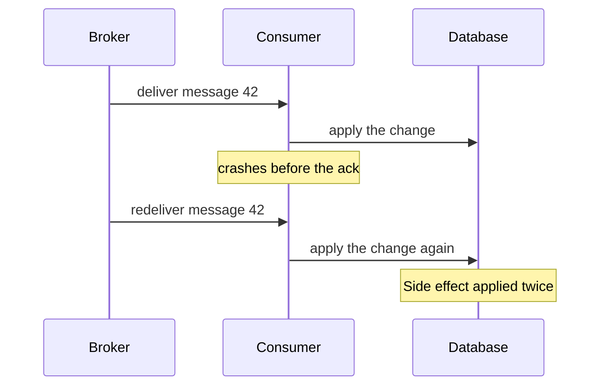
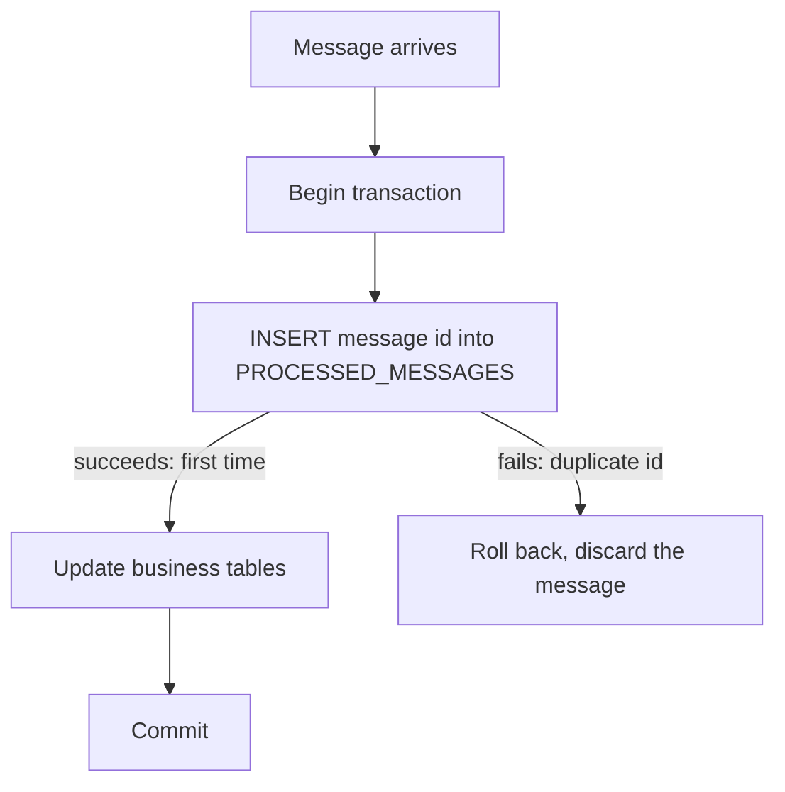

> [!TIP] The short version
> Assume every message can arrive **more than once**. Either make the operation **idempotent** (handling it twice has the same effect as handling it once), or **record the ids of the messages you have processed** and discard repeats. Do the recording in the same transaction as the business change.
>
> The second approach is what is often called the **Inbox pattern** (its id-tracking form).

## Context

When the system is working normally, a message broker that guarantees **at-least-once delivery** delivers each message only once. But a failure of the client, the network or the broker can result in a message being delivered several times.

A typical cause: the consumer **crashes after processing a message but before acknowledging it**. The broker never receives the acknowledgement, so it delivers the message again, either to that client when it restarts or to another replica of the client.

Other causes are the same on the sending side: the publisher retries because it never received an ACK, or the broker retries delivery after a network failure.

The worst case is that the message is processed twice, and so are its **side effects**. In a payment system, that could mean charging the customer twice.

## Two ways to solve it

| Approach | Idea | Use when |
| --- | --- | --- |
| **1. Idempotent message handlers** | The operation itself is safe to repeat. | The operation is naturally idempotent. |
| **2. Track messages and discard duplicates** (Idempotent Consumer) | Store the id of every processed message and skip repeats. | The operation is **not** naturally idempotent. |

### 1. Idempotent message handlers

Some operations are naturally idempotent, so duplicates do no harm:

- **Cancelling an already-cancelled order** is idempotent. The second cancel changes nothing.
- When consuming `OrderCreated`, the handler first checks whether the order already exists, and only then creates it.

Where this works, it is the simplest option: no extra storage and no bookkeeping.

### 2. Track messages and discard duplicates (the Inbox pattern)

When the operation is not naturally idempotent, the consumer keeps a record of what it has handled.

When it handles a message, it records the **message id as the primary key** in a `PROCESSED_MESSAGES` table, **as part of the same transaction** that creates or updates the business entities. That makes the two atomic.

If the message is a duplicate, the `INSERT` fails, and the whole transaction fails with it (the message table and the domain tables together). The consumer can then discard the message. No separate "does this id exist?" check is needed, because the primary key constraint does the work.

**Without a separate table.** The message handler can instead record the message ids in the domain table itself, for example a `ProcessedMessageIds` column on the `Order` table. This is especially useful with a **NoSQL database that has a limited transaction model**, where you cannot update two tables in one transaction.

> [!INFO] A bonus in CQRS
> Associating the list of event ids with the entity also resolves the "replication lag" problem in CQRS. See [CQRS](/event-driven-architecture/cqrs/) for more.

## Choosing an approach

| Situation | Approach |
| --- | --- |
| The operation is naturally idempotent (cancel, "create if not exists"). | Write an **idempotent handler**. No extra storage. |
| It is not idempotent, and you have a relational database. | Store ids in a **`PROCESSED_MESSAGES` table** (the inbox) in the same transaction. Duplicates fail on the primary key. |
| It is not idempotent, and the database has limited transactions (some NoSQL stores). | Keep the processed ids **on the entity itself**. |

## Where duplicates come from in practice

Duplicates are not only a broker problem. A reliable sender creates them on purpose: the [Transactional Outbox](/event-driven-architecture/transaction-messaging-outbox/) guarantees a message is *never lost*, at the price of sometimes sending it twice. Handling duplicates on the consumer side is the other half of that guarantee, and is listed as a standing challenge in [Event Driven Architecture](/event-driven-architecture/event-driven-architecture/).

## References

- Chris Richardson, *Microservices Patterns: With Examples in Java* (Manning, 2018) — Handling duplicate messages.
