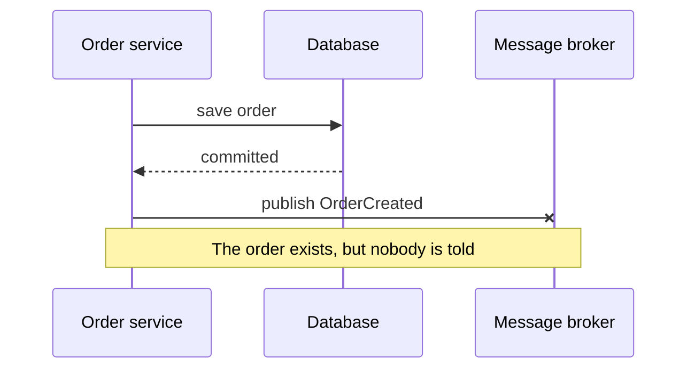

> [!TIP] The short version
> Never "save to the database, then publish to the broker" as two separate steps. Instead, **write the message into an `OUTBOX` table in the same database transaction** as the business change. A separate process reads the outbox and publishes to the broker. The two writes now succeed or fail together.

## Context

A service often needs to publish a message as part of a transaction that updates its database. For example, services publish domain events when they create business entities.

Both the database update **and** the message must happen atomically. If not, a service can update its database and then crash before sending the message, and the failure leaves the system in an inconsistent state.

## The problem: a dual write

Consider creating an order:

1. You save the order to the database.
2. You send a message to the broker to tell other services about the new order.
3. The broker call fails (a network error, say), but the database transaction has **already committed**.



The database and the broker are two separate systems, so no single transaction can cover both. The system cannot guarantee that the message will be sent once the database operation has succeeded.

## The solution: transactional outbox

- Use a database table (**OUTBOX**) as a temporary message queue.
- As part of the same transaction that creates, updates or deletes business objects, the service sends messages by **inserting them into the OUTBOX table**. Atomicity is guaranteed because this is a local ACID transaction.
- The **Message Relay** reads the OUTBOX table and publishes the messages to a message broker.


**With NoSQL databases**, each business entity gets an attribute holding a list of messages that still need to be published. When the service updates the entity, it appends a message to that list. This is atomic because it is a single database operation.

## How it works, step by step


1. **Single transaction.** The service saves the business data (the order, the user) **and** the event in the local outbox table, in one transaction. If one succeeds, so does the other.
2. **Outbox table.** It holds events or messages waiting to be sent to other services, and acts as a buffer.
3. **Background process.** A scheduled task or worker scans the outbox for unsent messages and sends them to the broker.
4. **Retry.** If sending fails, the process tries again. Once a message is sent, it is marked as sent (or deleted) in the outbox.

## Two ways to publish from the outbox

| | **Polling publisher** | **Transaction log tailing** |
| --- | --- | --- |
| **Idea** | Publish messages by polling the outbox table in the database. | Publish changes made to the database by tailing its transaction log. |
| **How** | Query the table, for example `SELECT * FROM OUTBOX ORDER BY ... ASC`, and publish what you find. | Every committed update is an entry in the transaction log. A log miner reads it and publishes each change as a message. |
| **Good for** | Simplicity: it is just a scheduled query. | Not needing to poll the database. |
| **Watch out for** | The delay between commit and publish depends on how often you poll. | It needs database-specific tooling. |

### Polling publisher

The Message Relay repeatedly queries the outbox for unsent rows, in order, and publishes them. It is the easiest to build and understand, and it is what the code sample below shows.

### Transaction log tailing

Committed inserts into the OUTBOX table are recorded in the database's **transaction log**. A **transaction log miner** reads that log and publishes each change to the message broker. The application only ever inserts into the outbox. It never talks to the broker.


This is the same idea as **change data capture (CDC)**: a tool watches the source database's transaction logs and streams the changes to a target such as Kafka.


**Tools for log tailing**

| Tool | What it does |
| --- | --- |
| [Debezium](https://debezium.io/) | Open source project that publishes database changes to the Apache Kafka message broker. |
| [LinkedIn Databus](https://github.com/linkedin/databus) | Open source project that mines the Oracle transaction log and publishes the changes as events. LinkedIn uses it to synchronise derived data stores with the system of record. |
| [DynamoDB Streams](https://docs.aws.amazon.com/amazondynamodb/latest/developerguide/Streams.html) | A time-ordered sequence of the changes (creates, updates, deletes) made to items in a DynamoDB table in the last 24 hours. An application can read them and, for example, publish them as events. |

## Implementation

A polling version in C#: first the business data and the outbox message are saved in one transaction, then a background process publishes unsent messages.

```csharp
// Insert order and event in a single transaction
using (var transaction = _dbContext.Database.BeginTransaction())
{
    try
    {
        // Insert order into the orders table
        var order = new Order { /* order details */ };
        _dbContext.Orders.Add(order);

        // Insert event into the outbox table
        var outboxMessage = new OutboxMessage
        {
            EventType = "OrderCreated",
            Payload = JsonConvert.SerializeObject(order),
            CreatedAt = DateTime.UtcNow
        };
        _dbContext.OutboxMessages.Add(outboxMessage);

        _dbContext.SaveChanges();
        transaction.Commit();
    }
    catch (Exception)
    {
        transaction.Rollback();
        throw;
    }
}

// Background process that sends outbox messages to the message broker
var unsentMessages = _dbContext.OutboxMessages
    .Where(m => !m.IsSent)
    .ToList();

foreach (var message in unsentMessages)
{
    try
    {
        // Send message to the message broker
        _messageBroker.Send(message.EventType, message.Payload);

        // Mark the message as sent
        message.IsSent = true;
        _dbContext.SaveChanges();
    }
    catch (Exception ex)
    {
        // Log error and retry later
    }
}
```

## Duplicates: pair it with an inbox

Look at the background loop: if the process crashes *after* `Send` but *before* `IsSent = true` is saved, the message is sent again on the next run. The outbox therefore gives **at-least-once** delivery, not exactly-once.

The receiving side must cope with duplicates. The **Inbox pattern** is the mirror image of the outbox: the consumer records the ids of the messages it has processed (in the same transaction as its own work) and ignores any repeats. See [Message Idempotency](/event-driven-architecture/message-idempotency/) for the full pattern. Together, the two make an end-to-end reliable flow. This is the same idempotency requirement listed under the challenges in [Event Driven Architecture](/event-driven-architecture/event-driven-architecture/).

## Benefits and drawbacks

| | |
| --- | --- |
| **Consistency** | The database and the outgoing messages stay consistent, because the guarantee comes from a database transaction. |
| **Resilience** | Saving data and sending messages are decoupled, so failures can be retried and recovered from. |
| **Failure tolerance** | If the broker is temporarily down, the system keeps working normally. Messages are sent later. |
| **Complexity** | You need an extra outbox table and a background process to scan it. |
| **Latency** | There is a small delay between storing the event and delivering it, depending on how often the process runs. |

## References

- Chris Richardson, *Microservices Patterns: With Examples in Java* (Manning, 2018) — Transactional outbox, Polling publisher and Transaction log tailing.
- [Outbox Pattern For Reliable Microservices Messaging — Milan Jovanović](https://www.milanjovanovic.tech/blog/outbox-pattern-for-reliable-microservices-messaging)
- [modular-monolith-with-ddd — Kamil Grzybek (GitHub)](https://github.com/kgrzybek/modular-monolith-with-ddd) — includes an Inbox pattern implementation.
- [Debezium](https://debezium.io/)
- [LinkedIn Databus](https://github.com/linkedin/databus)
- [DynamoDB Streams — AWS documentation](https://docs.aws.amazon.com/amazondynamodb/latest/developerguide/Streams.html)
