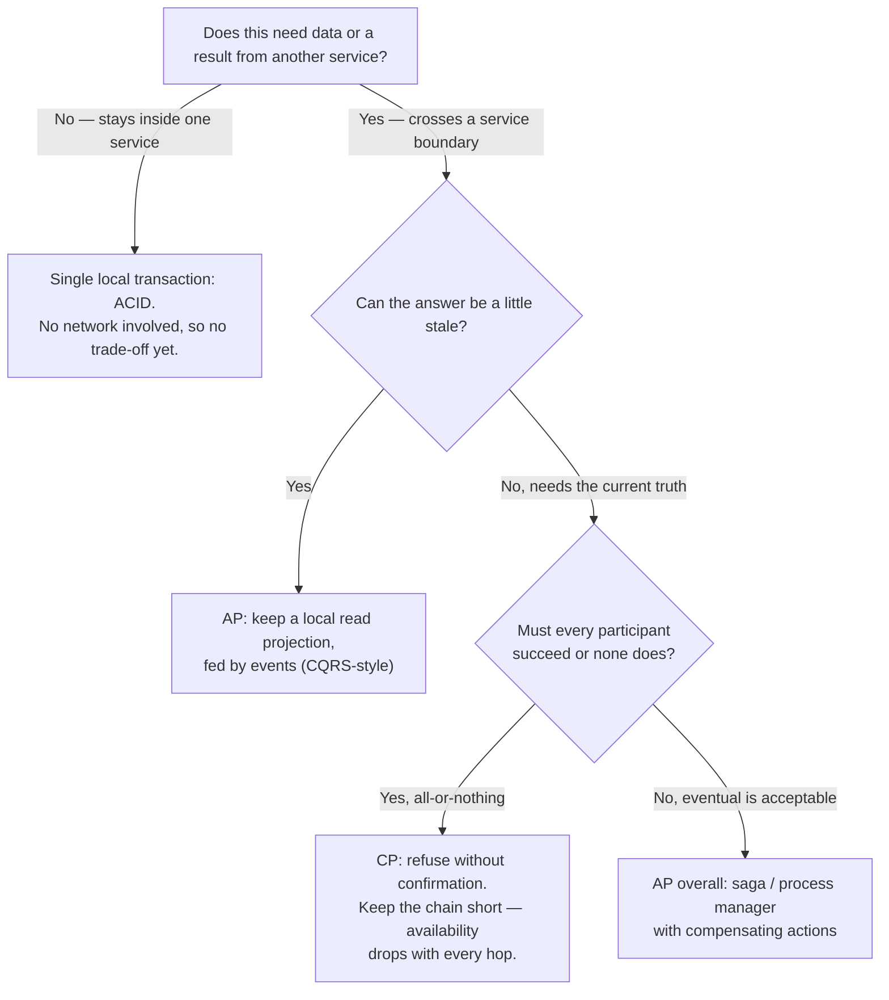
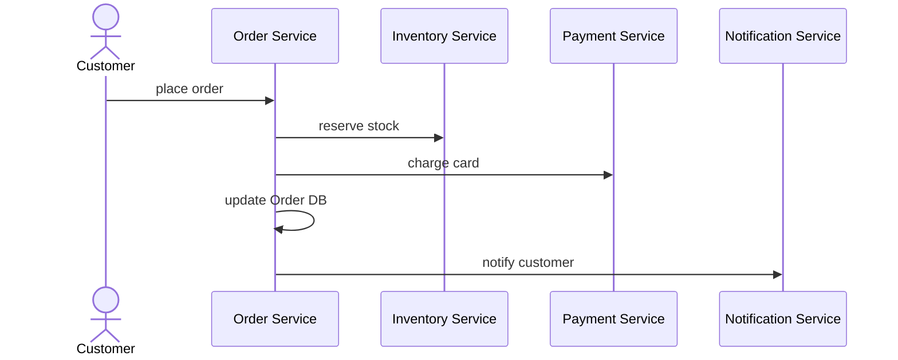

> [!TIP] The short version
> In 2000, Eric Brewer conjectured — and it was later proven — that a distributed data store can give you only two of **Consistency**, **Availability**, and **Partition tolerance** at once. Partition tolerance isn't really a choice — networks fail whether you plan for it or not — so the real decision only shows up **during a partition**, and it's between the other two:
>
> - **CP** — refuse the request rather than risk stale data.
> - **AP** — answer anyway, possibly with stale data.
>
> **CA doesn't exist** for anything that talks over a network. The theorem was framed around a single distributed data store, but it applies to any distributed system that maintains state and answers requests — including a **microservice architecture**, where every service-to-service dependency is its own miniature version of the same trade-off.

## Definitions

| Property | Meaning |
| --- | --- |
| **Consistency** | Every read returns the most recent write, or an error. Every node gives the same answer. |
| **Availability** | Every request to a non-failing node gets a (successful) response. |
| **Partition tolerance** | The system keeps working even though messages between nodes are being dropped or delayed. |

> [!NOTE] Partition tolerance isn't optional
> "Partition" here means a network failure between nodes — not a data-sharding partition. You don't get to switch it off: links between processes, data centers and services fail on their own schedule, not yours. So partition tolerance isn't really the third option you trade away; it's the constraint that forces the trade-off between the other two.

## A worked example: two data centers

Imagine an `Inventory` service deployed across two data centers, each with its own database, synchronized by multiprimary replication. Reads and writes go to the local node; replication keeps the two in sync.

Now the network link between the two data centers fails. Replication stops. A write in DC1 no longer reaches DC2, and vice versa. The service is still up on both sides — so what does each side do with a request?

### Sacrifice consistency → AP

Keep serving requests on both sides. DC2 now answers with data that doesn't reflect DC1's latest write — it's *stale*, not wrong on its own terms, just out of date. The system stayed **available** through the **partition**, at the cost of **consistency**. This is an **AP** system.

If you keep accepting writes on both sides during the partition, you've also signed up for reconciling them once the link comes back — and the longer the partition lasts, the harder that reconciliation gets. Even without an outright network failure, replication is never instantaneous, so any system that accepts this trade-off is, by definition, **eventually consistent**: every node converges on the same value *eventually*, not on every read.

### Sacrifice availability → CP

To guarantee consistency, a node has to know its copy matches the other node's before it can safely answer. But the nodes can't talk to each other — that's the partition. With no way to confirm agreement, the only safe move is to refuse the request. The system stayed **consistent** and **partition tolerant**, at the cost of **availability**. This is a **CP** system.

Multi-node consistency is one of the hardest things to get right in a distributed system. A consistent read across nodes really means a transactional read: lock the record everywhere, read it, release the lock everywhere — and now imagine the release message doesn't arrive because the node you need to talk to is unreachable. If you need this guarantee, don't build it yourself — reach for a data store or lock service designed for it (Consul's key-value store, for instance, is built to be strongly consistent). Otherwise, put the effort into building a good eventually consistent AP system instead.

### Why CA doesn't exist

If a system has no partition tolerance, it must not be split across a network — no distributed replicas, no remote nodes, nothing that can be cut off from anything else. That's a single process, not a distributed system. **CA systems don't exist in distributed systems** — the moment you replicate or shard across a network, you're choosing between CP and AP, not opting out of the choice.

## The three combinations

| Combination | You keep | You give up | In practice |
| --- | --- | --- | --- |
| **CP** | Consistency + partition tolerance | Availability | Reject or block the request during a partition, rather than risk a wrong answer. |
| **AP** | Availability + partition tolerance | Consistency | Answer from local data during a partition; it may be stale. |
| **CA** | Consistency + availability | Partition tolerance | Only possible with no network between nodes — not a realistic option for a distributed system. |

## Examples by data store

| Property | What it looks like | Examples |
| --- | --- | --- |
| **Consistency** | Every read gets the latest write; no stale data. | Relational databases (SQL); MongoDB in its strong-consistency mode. |
| **Availability** | The system keeps responding even when some nodes are unreachable. | DynamoDB, Cassandra — they answer even if that means a stale value. |
| **Partition tolerance** | Keeps working despite nodes being unable to reach each other. | Every distributed system needs this; it isn't optional. |

## It's not all-or-nothing

**A whole system isn't one label.** A product catalog can be AP — a five-minute-stale description is harmless — while the inventory count backing checkout is CP, because overselling has a real cost.

**Not even one service is one label.** Take a `Points Balance` service tracking loyalty points: showing a stale balance is fine, but *spending* points must be checked against a consistent balance so a customer can't spend more than they have. That one service is AP for reads and CP for writes — the CAP trade-off has simply moved down to the level of the individual capability, not the service boundary.

**Not even one read is one label.** Some stores let you choose per call. Cassandra, for example, can block a read until *all* replicas agree, until a *quorum* agree, or return as soon as a *single* node responds — trading latency for consistency call by call.

> [!IMPORTANT] "Beating" CAP theorem
> You'll see claims of systems that "beat" the CAP theorem. They haven't — the proof holds. What they've actually built is a system where some capabilities are CP and others are AP. Mixing the two per capability is a design choice, not a loophole.

## The real world doesn't wait for your consistency model

However consistent your databases are, they only describe the electronic world — and much of what a system tracks is a proxy for something physical. An inventory count might say 99 copies of an album are on the shelf, perfectly replicated everywhere, right up until someone drops a copy and it breaks. The system is still "consistent"; it's just wrong, because the real world changed in a way no database transaction observed.

This is one of the strongest arguments for AP in practice: a CP system can guarantee agreement between its own nodes, but it can't guarantee agreement with reality. Sam Newman puts it directly:

> We have to recognize that no matter how consistent our systems might be in and of themselves, they cannot know everything that happens, especially when we're keeping records of the real world. This is one of the main reasons that AP systems end up being the right call in many situations. Aside from the complexity of building CP systems, they can't fix all our problems anyway.

## Why this matters once you split into services

Everything above is the theorem in its original habitat: one data store, replicated across nodes. A microservice architecture hits the same wall, just with the "nodes" replaced by services.

Inside a monolith, consistency is mostly free. One process, one database, one ACID transaction — commit, and every table involved agrees, always, because nothing had to cross a network to get there. There's no partition to survive, so the trade-off never has to be made explicitly.

Database-per-service breaks that. Two services that used to share a table now each own their own copy of the truth, kept in sync by network calls that can fail, stall, or arrive late. Every place two services need to agree on something is now a miniature version of the same partition scenario above — and the architecture has to answer, explicitly, which side it gives up.

| In a monolith | In a microservice architecture | CAP category |
| --- | --- | --- |
| One ACID transaction across tables | A **saga** / process manager with compensating steps | Individual steps are local ACID (CP-in-the-small); the overall flow is AP — it succeeds *eventually*, not atomically. |
| A SQL join across tables | A local **read projection** kept current by events ([CQRS](/event-driven-architecture/cqrs/)) | AP — the projection can lag the source of truth. |
| A function call for fresh data | A **synchronous call** across a service boundary | Only CP if the callee's answer is atomically safe and you refuse to proceed without it — the call itself just couples your availability to the callee's. See [why this coupling is usually the wrong fix](/microservices/service-to-service-synchronous-communication-pitfall/). |
| A foreign key | A shared **identifier**, with each service holding only the fields it owns | Sidesteps the trade-off — there's no cross-service read on the hot path at all. |

This is why the vocabulary of microservice architecture is full of CAP's fingerprints: eventual consistency, sagas, outbox, idempotent consumers. They aren't stylistic choices — they're what an AP posture requires you to build once you've decided a given capability shouldn't pay for cross-service consistency with its availability. And because a microservice architecture is, by construction, a network of independent processes, CA is off the table for anything that crosses a service boundary — the same reasoning as above, just applied one level up.

## How CAP shapes concrete architecture decisions

CAP isn't a fact you note and move past — it's a question you answer every time you draw a service boundary or wire two services together.

- **Sizing a bounded context is a CAP decision.** Anything that must be atomically consistent has to live inside one transaction boundary — which means inside one service. This is exactly the "consistency boundary" test used when [finding bounded contexts](/microservices/microservice-boundary/#step-1-find-the-bounded-contexts): if two things must change together, in one transaction, they aren't two services — they're one. Draw the boundary too small, and you've manufactured a distributed CAP problem that a slightly larger boundary would have made a local, ACID one.
- **A synchronous call buys coupling, not consistency.** Waiting for another service's answer only tells you *something* responded — whether that answer is safe against concurrent writes depends on the callee doing an atomic check-and-act (a conditional update, not a read followed by a separate write), not on how the caller asked. What makes a flow CP is refusing to proceed without that confirmed, atomic answer; the synchronous call is just the mechanism for waiting, and its real cost is that your availability now compounds with every hop in the chain. That coupling is rarely a deliberate choice — it's usually a sign the boundary or the data ownership is wrong. See [the synchronous-call pitfall](/microservices/service-to-service-synchronous-communication-pitfall/) for the decision ladder.
- **Cross-service writes use a saga, not a distributed transaction.** Two-phase commit across services is a CP move that gets more fragile as you add participants: it ties the whole transaction's availability to the least available participant. A saga instead accepts each local step as it succeeds, uses compensating actions to unwind if a later step fails, and lets the overall operation become consistent *eventually* — an explicit AP choice at the workflow level.
- **Cross-service reads use a local projection, not a live call.** [CQRS](/event-driven-architecture/cqrs/) read models, kept current by events, are how you get AP at the query side: always answer, from local data, accepting some lag. The [Transactional Outbox](/event-driven-architecture/transaction-messaging-outbox/) pattern is what keeps those events reliable, and [message idempotency](/event-driven-architecture/message-idempotency/) is what keeps a projection correct when the same event shows up twice.
- **Timeouts, retries and circuit breakers are partition-tolerance engineering.** They're how a service stays AP under a partition instead of hanging: fail fast, degrade, or serve a cached answer rather than block waiting on a dependency that may never come back in time.

## Example: placing an order

An e-commerce checkout touches several services: `Order`, `Inventory`, `Payment`, and `Notification`.

Now suppose `Inventory` is unreachable — partitioned away from `Order` — right when the customer clicks "buy." This is where the architecture's CP-or-AP choice, made in advance, actually pays off (or doesn't).

**CP approach:** `Order` refuses the request rather than proceed without a confirmed reservation. **A synchronous call doesn't make this consistent** — it only stops `Order` acting on missing information. `Inventory` still has to reserve stock as a single atomic operation (a conditional decrement, not a separate check-then-reserve), or concurrent orders can each get "confirmed" and still oversell. And even then, "reserve stock" and "create the order" aren't atomic *together* just because the call was synchronous — real atomicity across two services needs a distributed transaction (2PC) or putting both writes in one database. 2PC doesn't escape CAP either: it relocates the same availability cost into the commit protocol (every participant blocks until all are reachable), with its own failure mode if the coordinator crashes mid-commit. So there's no clean CP option at this service boundary — merge `Order` and `Inventory`, accept 2PC's blocking, or accept AP with a saga. What refusing on no-answer actually buys is narrower than "consistent": it avoids acting on missing information, at the cost of coupling `Order`'s availability to `Inventory`'s.

**AP approach:** `Order` assumes the stock is fine — from a local projection of inventory levels, kept current by events — and continues with payment and order creation. The real reservation is confirmed asynchronously; if it fails, a saga issues a compensating action (cancel the order, refund the payment). This can mean occasionally overselling, which is an acceptable trade for a retailer that would rather apologize to a few customers than turn away sales during a traffic spike.

| Capability | Preferred pair | Architectural implication |
| --- | --- | --- |
| Product catalog (read-heavy) | **AP** | Serve from a cached or replicated read model; never call the source of truth synchronously. |
| Order and payment (sensitive) | **CP** | Keep the critical check inside one transaction boundary where possible; where it must cross services, accept the availability cost or use a saga with strict compensations. |
| Notification or analytics | **AP** | Fire-and-forget via events; idempotent consumers absorb retries and duplicates. |

## References

- Sam Newman, *Building Microservices*, 2nd Edition (O'Reilly Media, 2021) — Chapter 12, CAP Theorem.
- Chris Richardson, *Microservices Patterns: With Examples in Java* (Manning, 2018).
- [CAP theorem — Wikipedia](https://en.wikipedia.org/wiki/CAP_theorem)
- [CAP theorem — AWS Whitepaper: Availability and Beyond](https://docs.aws.amazon.com/whitepapers/latest/availability-and-beyond-improving-resilience/cap-theorem.html)
