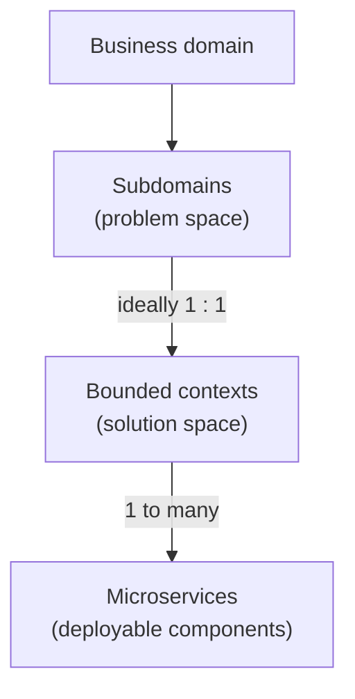
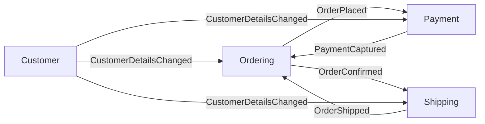

> [!TIP] The short version
> A good microservice boundary encloses **one business capability, end to end**: its logic **and** its data. Inside it, a team can change and deploy without asking anyone, and the service keeps working when its neighbours are down. Across it, services talk only through **events and published contracts**.
>
> Finding boundaries is two separate decisions: **1. Where are the bounded contexts?** (business analysis) and **2. How small should each one be split?** (measurable drivers). Do them in that order.

## Two decisions, in order

| Decision | The question | Main tools |
| --- | --- | --- |
| **1. Bounded contexts** (what) | Where does one business capability end and the next begin? | Subdomains, object life cycle, Event Storming, language, data ownership |
| **2. Granularity** (how small) | Inside a bounded context, should this be one deployable unit or several? | Twelve splitting drivers (disintegrators) weighed against reasons to keep things together (integrators) |

Most boundary mistakes come from mixing these up: splitting into tiny services (decision 2) before the business boundaries (decision 1) are understood.

## What a boundary is

There are two levels, and they are easy to confuse.

| | **Bounded context** (a "service") | **Microservice** (a "component") |
| --- | --- | --- |
| **What it is** | The **technical authority for a specific business capability**. The logical boundary of the inputs, outputs, events, requirements, processes and data models relevant to a subdomain. | A **logical unit of deployment**: the technical authority for a specific part of a bounded context. |
| **How it is cut** | By business capability. It is a property of the **solution space**. | By business function, technical function, or both. |
| **Membership** | Consists of one or many microservices. | Belongs to **exactly one** bounded context. |
| **Can they be the same thing?** | Yes: a bounded context can be a single microservice. | Logical and physical usually match, but they don't have to. |

Ideally a bounded context lines up exactly with one subdomain. In practice, legacy systems, technical debt and third-party integrations create exceptions.

A good bounded context is:

- **Highly cohesive.** Its internal operations are intensive and closely related, and most communication happens inside it rather than across its border. That keeps its design scope small and its implementation simple.
- **Loosely coupled to its neighbours.** A change inside one context should minimise or eliminate the impact on the others, so a requirement change doesn't ripple into a surge of dependent changes.

## The rules of a boundary

**Between bounded contexts**

| Rule | Why it matters |
| --- | --- |
| A service is the technical authority for **one business capability**. | It has a single reason to change. |
| It must **not know about other services**. It may know and use their **contracts**. | Knowing internals creates hidden coupling. |
| It must **not call other services by RPC**. | Avoids temporal coupling. See [the synchronous call pitfall](/microservices/service-to-service-synchronous-communication-pitfall/). |
| It must **not integrate through a shared database**. | A shared schema is a shared boundary, so there isn't one. |
| It shares contracts as **schemas**, never as classes or data types. A contract must not be a serialised domain object. | Keeps each side free to evolve its own model. |
| It **owns its domain**: the domain model must not escape the boundary. | Prevents one context's model leaking into another. |
| It **owns its state**: the state is private to the service. | Data ownership is the strongest test of a boundary. |
| It **raises events** describing its results. | Others can react without being told what to do. |
| It must **not send commands to other services**. | Commands may only be sent *within* a service boundary. |

**Inside a bounded context**, the microservices are allowed to share the same domain, and may share the same data. They can make RPC calls to each other, but should not unless there is a reason.

### What may cross the boundary

A contract takes one of three forms:

| Form | Crosses the boundary? | What it is |
| --- | --- | --- |
| **Command** | **No.** It stays inside the service's boundary. | A message (schema) the service can *receive* to perform a task. |
| **Event** | **Yes.** | A message the service *sends* to say what it did. It is **consumer-agnostic**: never addressed to a particular consumer and never designed for one. It usually reports the result of a business task, but can also occur without a command, for example a timer tick or a time-out event. |
| **Data** | Yes, as published documents. | A schema for documents published for external use, for example daily aggregated data on S3. |

**Projections** are read-friendly views that a service builds from events, for its own use cases. They never cross the boundary and are not part of the contract. Each service builds its own.

## Step 1: find the bounded contexts

No single technique is enough. Use several and look for where they agree.

| Technique | Ask | It is a boundary when... |
| --- | --- | --- |
| **Align with subdomains** | What are the core, supporting and generic subdomains of the business? | Each subdomain gets its own bounded context (problem space → solution space). |
| **Follow an object's life cycle** | Does the same concept mean something different at each stage? | Different teams care about different properties at each stage. A "Book" in editing is not a "Book" in shipping. |
| **Event Storming** | Where does the flow of events cross a department, or where do people argue about a term? | The flow, or the vocabulary, changes. See [Event Storming](/domain-driven-design/event-storming/). |
| **Departments and work groups** | Which business function and which domain expert owns this? | Each function has its own expert and vocabulary. |
| **Overloaded terms** | Does one word ("Policy", "Customer") have several meanings depending on who you ask? | You have found several contexts, each with its own model. |
| **Business capabilities** | What does the business *do*, stated as a capability? | Each stable capability is a candidate boundary. |
| **Data ownership** | Who is the single source of truth for this data, and who may change it? | Different owners mean different contexts. Data that must be changed together stays together. |
| **Consistency boundary** | What must change atomically in one transaction? | Anything that needs strong consistency belongs in one context, ideally in one aggregate. |
| **Team ownership** | Can one team own this end to end, including on-call? | It can. Boundaries that need two teams to coordinate on every change are wrong. |
| **Change history (existing code)** | Which parts of the code change together in version control? | Things that always change together belong together. Things that change independently are candidates for separation. |

Details on the first three are in [Identifying Bounded Contexts](/domain-driven-design/identifying-bounded-contexts/).

## Step 2: decide how small each one should be

A bounded context does not have to be a single deployable. Splitting it into several microservices is a **trade-off**, and the trade-off has two sides.

### Reasons to split (disintegrators)

There are twelve. The first six are the classic set from *Software Architecture: The Hard Parts*. The other six come from practice. For each, the useful question is not "does this feel true?" but "**how would I measure it?**"

#### The six classic drivers

| # | Driver | Split when... | How to tell | Example |
| --- | --- | --- | --- | --- |
| 1 | **Scope and function** | The service does several unrelated things. | You need "and" more than once to describe it. Low internal cohesion. | A Customer service split into Profile, Preferences and Comments. |
| 2 | **Code volatility** | One part changes much more often than the rest. | Commit history: one area gets most of the changes and triggers most releases. | Postal-letter code changes often; SMS and email rarely. |
| 3 | **Scalability and throughput** | Parts need very different capacity. | Metrics: request rates or resource use differ by orders of magnitude between parts. | SMS at 220,000 per minute, email at 500, letters at 1. |
| 4 | **Fault tolerance** | One part fails often and drags the rest down. | Incident history: one part causes most errors and its failures spread. | A flaky email path should not take SMS and letters with it. |
| 5 | **Security** | Parts have different security needs. | Data classification: parts handle data of different sensitivity or with different access rules. | Profile info (low) versus credit card info (high). |
| 6 | **Extensibility** | You keep adding new variants of the same thing. | The roadmap: each new variant touches existing code. | Payment methods: credit card, gift card, PayPal, the next one. |

#### Six more drivers from practice

| # | Driver | Split when... | How to tell | Example |
| --- | --- | --- | --- | --- |
| 7 | **Team ownership** | Two or more teams keep colliding in one service, or it is too big for one team to understand. | Several teams commit to it, changes wait on other teams, new joiners take months to become productive. | The Checkout and Promotions teams both editing one Cart service. |
| 8 | **Release cadence and risk** | Parts need to ship at very different speeds or with different levels of scrutiny. | Deploys per week differ a lot between parts; one part needs sign-off and the other doesn't. | Frequently tested recommendation widgets versus an audited pricing engine. |
| 9 | **Technology fit** | A part needs a different language, runtime or hardware. | The best tool for one part is not the best tool for another, and forcing one stack hurts. | GPU-based model inference next to a Java order service. |
| 10 | **Data characteristics** | Parts need different storage models, retention rules or consistency levels. | Access patterns differ: search and analytics versus transactions; eventual versus strong consistency. | A search-indexed product catalogue versus strongly consistent inventory. |
| 11 | **Compliance and data residency** | A part falls under stricter regulation, or its data must stay in a region. | Data classification and audit scope: one part would pull everything into scope. | Isolating card handling to shrink the payment audit scope. |
| 12 | **Workload profile** | Batch or long-running jobs share a service with latency-sensitive requests. | Latency of interactive calls degrades while batch jobs run; the CPU and memory profiles differ. | Nightly report generation versus the interactive API. |

### Reasons to keep together (integrators)

| Driver | Keep together when... |
| --- | --- |
| **Database transactions** | Operations must be atomic (ACID) and a distributed transaction would be painful. |
| **Workflow and choreography** | The parts are always called in sequence and would chat constantly across the network. |
| **Shared code** | Splitting would force copying or sharing a lot of common code. |
| **Data relationships** | The parts are tightly bound by the same data, and splitting would mean splitting the data. |

**The rule:** split only when a disintegrator is **real and measurable**, and it outweighs the integrators. "It feels too big" is not a reason. "This part needs 400 times the capacity of that one" is. One driver is often enough. Several pointing at the same seam is a strong signal.

## Step 3: design how the boundary talks

Once the boundaries are drawn, decide how they communicate.

- **Across contexts, use events.** Publish results as consumer-agnostic events. Make publishing reliable with the [Transactional Outbox](/event-driven-architecture/transaction-messaging-outbox/), and make consuming safe with [Message Idempotency](/event-driven-architecture/message-idempotency/).
- **When a context needs data from another,** don't call it. Keep a local projection built from events. See [the synchronous call pitfall](/microservices/service-to-service-synchronous-communication-pitfall/).
- **When a business workflow crosses contexts,** use a **process manager**: a component that listens to events and sends commands, in effect "when A happens, do B". It is usually stateful. It decides **what** happens next, never **how**: the doing stays in the services. Its processes can even be endless. Be precise with the vocabulary: some teams reserve the word *saga* for a different pattern, so don't use the two as synonyms.
- **Inside a context,** commands and events are both fine, and direct calls between microservices are allowed when justified.

## Red flags: signs of a wrong boundary

| Symptom | What it usually means |
| --- | --- |
| A service calls another synchronously to get data it needs to do its job. | The data is owned in the wrong place, or the boundary is wrong. |
| Two services always change and deploy together. | They are one service, or you have a distributed monolith. |
| Services share database tables. | There is no real boundary. |
| A service can't work when its neighbours are down. | Too much temporal coupling. |
| Most of a service's calls go to one other service. | Chatty coupling: they probably belong together. |
| A service only stores and returns one entity (a CRUD "Customer service"). | An entity service, which follows the data rather than the business capability. |
| One term has two meanings inside the same service. | Two contexts hiding in one. |
| There is a service for every function or class. | Nano-services: too fine, with the cost of distribution and none of the benefit. |
| One service owns everything and the others are thin wrappers. | A god service. |

## Test a boundary

Before you commit to a boundary, ask:

| Test | Question | Good answer |
| --- | --- | --- |
| **Autonomy** | Can it do its job with every other service down? | Yes |
| **Data** | Does it own all the data it needs to make its decisions? | Yes, or it holds a projection |
| **Change** | Does a typical business change touch only this service? | Yes |
| **Deploy** | Can it be released without releasing anything else? | Yes |
| **Team** | Can one team own it end to end? | Yes |
| **Language** | Does every term mean one thing inside it? | Yes |
| **Contract** | Do others depend only on its events and schemas? | Yes |
| **Justification** | If it is split further, which measurable driver justifies it? | A named one from the list above |

## Worked example: an online shop

Four contexts, each owning its data and communicating only through events:

- The same person is a **Customer** (contact details), a **Buyer** in Ordering, a **Payer** in Payment and a **Recipient** in Shipping. Each context holds only the part it needs, keyed by a shared customer id.
- Payment doesn't call Customer for a billing address. It owns it, or keeps a projection built from events.
- If Payment turns out to need much more capacity than Ordering, that is a driver for splitting it further, **inside** its own context.

## Start coarse and evolve

- **Start with fewer, larger boundaries**, even a well-structured modular monolith, and split when a measured driver appears. Merging services that were cut too small is much harder than splitting one that was cut too large.
- **Treat boundaries as hypotheses.** Revisit them as you learn the domain, and watch the red flags in production: sync calls creeping in, coordinated deployments, shared tables.
- **Change boundaries deliberately.** Moving data and behaviour between contexts is expensive, so make that trade-off visible rather than drifting into it.

## References

- Adam Bellemare, *Building Event-Driven Microservices* (O'Reilly Media, 2020) — definition and properties of a bounded context.
- Neal Ford, Mark Richards, Pramod Sadalage and Zhamak Dehghani, *Software Architecture: The Hard Parts* (O'Reilly Media, 2021) — Chapter 7, Service Granularity: the six classic granularity disintegrators and the integrators. Drivers 7 to 12 are added from practice.
- Vaughn Vernon, *Domain-Driven Design Distilled* (Addison-Wesley, 2016) — aligning bounded contexts with subdomains, object life cycle and Event Storming.
- Eric Evans, *Domain-Driven Design: Tackling Complexity in the Heart of Software* (Addison-Wesley, 2003) — bounded context and ubiquitous language.
