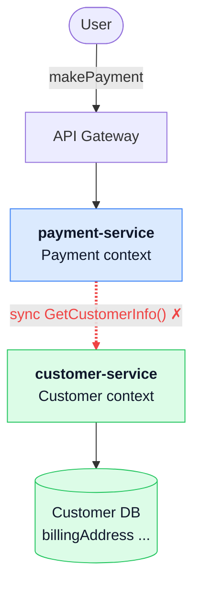
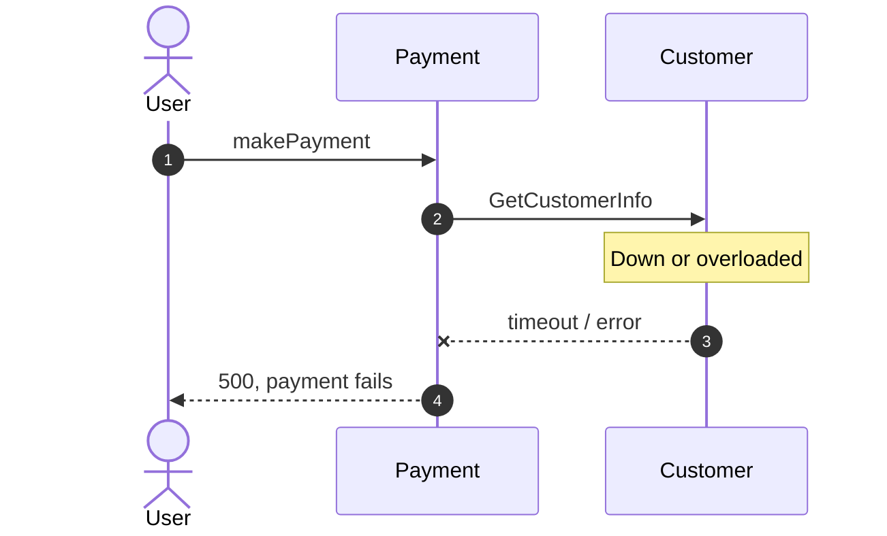
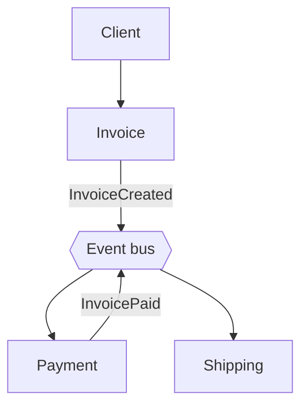
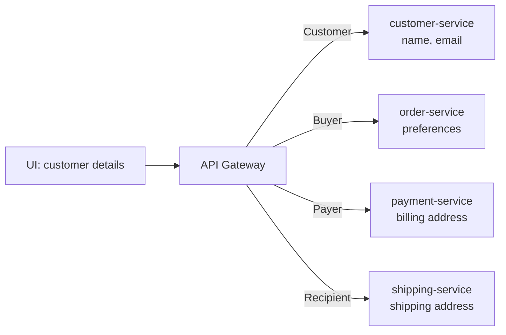
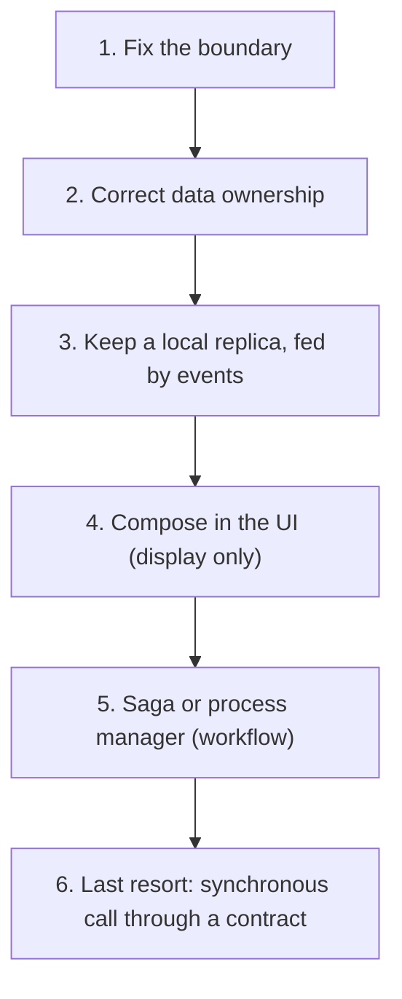
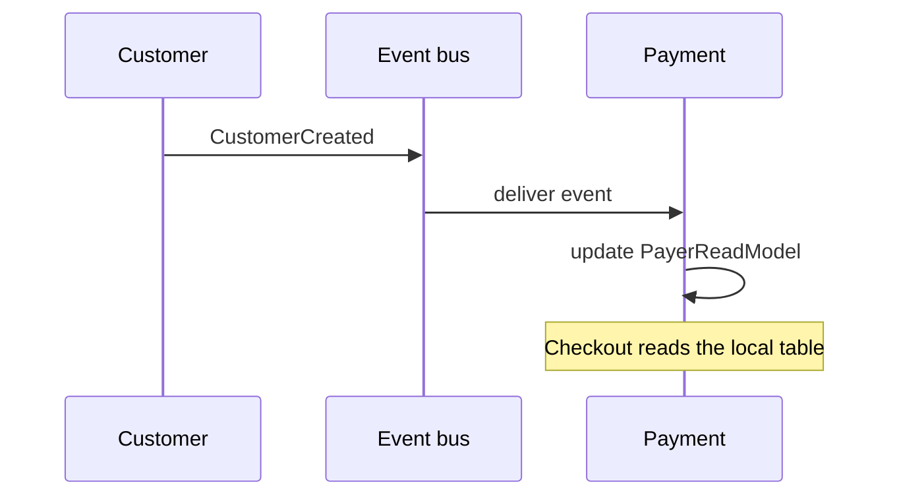
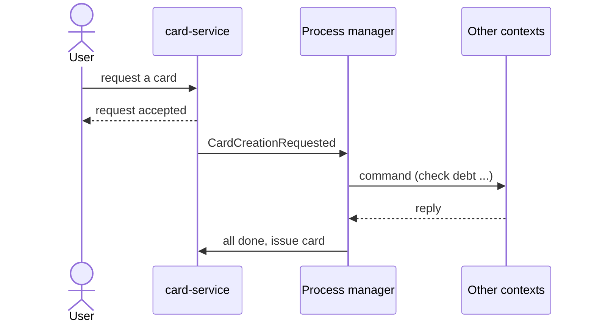

> [!WARNING] The short version
> **A synchronous call from one bounded context to another is a design flaw, not a networking problem.**
> It means the boundary is drawn in the wrong place, or the data is owned by the wrong service. A faster RPC, a retry policy or a circuit breaker treats the symptom. The fix is in the design.
>
> **Rule of thumb:** *inside* a bounded context, call freely. *Across* bounded contexts, don't call — **own it, replicate it, or orchestrate it.**

## The scenario

An e-commerce checkout. The **Payment** service needs the customer's **billing address** to charge a card, but that address lives in the **Customer** service's database. The obvious solution is a quick HTTP call:



It feels natural because in a monolith this was a SQL query on the `Customer` table. But that dotted red line crosses a bounded-context boundary, and that is where the trouble starts.

## Why it is a design flaw

| # | Problem | What it means in practice |
| --- | --- | --- |
| 1 | **Wrong boundary** | If a service must ask another service for data to do its own job, the two are not really independent. |
| 2 | **Temporal coupling** | Both services must be up at the same moment, or the request fails. |
| 3 | **Dependent scaling** | Scaling Payment forces you to scale Customer too. |
| 4 | **Distributed monolith** | You pay for a distributed system and get none of the autonomy. |
| 5 | **Lower availability** | The chain is only as available as all its links combined. |

### 1. The boundary is wrong

> "A service is the technical authority for a given business capability." — Udi Dahan

A service is a vertical slice that owns **all the data and logic** for its capability. Udi Dahan's guidance is blunt: if a service needs to synchronously call another service to get data in order to do its job, that is usually a sign the boundaries are wrong — *not a problem to be solved with a better RPC mechanism*.

So the first move is always to **challenge the requirement**, not to satisfy it. Ask: *why doesn't Payment already own the billing address?*

### 2. Temporal coupling

Payment can only succeed while Customer is reachable and fast. When Customer is down or slow, Payment fails or slows down too:



The user tried to pay. The payment service was healthy. It still failed because of a service it should never have needed.

### 3. Dependent scaling

Independent scaling is one of the main reasons to use microservices. With a synchronous call, **1,000 requests to Payment become 1,000 immediate requests to Customer**. Payment can only scale as far as Customer (and whatever Customer calls in turn) can follow, and a traffic spike hits every service in the chain at once.

### 4. The distributed monolith

This is the classic result of splitting a monolith and keeping the old habits: each remote call slots in "line for line" where a function call used to be. The code is now spread over the network, but the coupling is unchanged.

> [!IMPORTANT] Symptoms of a distributed monolith
> - Services are deployed separately but must change together.
> - A service cannot start or work unless others are running.
> - A user request triggers a chain of synchronous calls across many services.
> - Services share database tables, or one service knows another's internals.
> - One service is a "coordinator" that knows too much, and the others behave like remote procedures.

### 5. Lower availability

Availability multiplies along a chain. An illustration with round numbers:

| Setup | Each service | End-to-end availability | Downtime per month |
| --- | --- | --- | --- |
| One service, no dependency | 99.9% | 99.9% | about 44 minutes |
| Chain of 4 synchronous calls | 99.9% | about 99.6% | about 2 hours 55 minutes |

This is why Chris Richardson writes that to maximise availability you must **minimise synchronous communication**. In CAP terms, most architects today prefer a system that stays *available* over one that is instantly *consistent*.

### A worse case: the chain

Sam Newman's observation is that synchronous calls become really problematic when they form **chains** — an issue in any service, or in the network between them, can fail the whole operation. The same shape appears when a business flow is built as request/response across contexts:


Here Invoice becomes an over-informed coordinator. If Payment is slow, Invoice blocks. If Shipping fails, the whole transaction fails. The rule "an invoice must be paid before shipping" is spread over three services, so they must be changed and deployed together.

The event-driven alternative lets each service react on its own:



No service calls another. If Shipping is down, invoices and payments still work, and shipping catches up when it returns.

## The real fix: let the caller own the data

Back to the question: **why doesn't Payment own the billing address?**

Because we modelled one big `Customer` that holds everything:

```csharp
public class Customer            // the "god class"
{
    public Guid Id;
    public string Name;
    public string Email;
    public BillingAddress BillingAddress;
    public PaymentCards PaymentCards;
    public ShippingAddress ShippingAddress;
    public ShoppingPreferences Preferences;
}
```

In Domain-Driven Design, one model that tries to serve every context is a design smell. That is exactly why **Bounded Contexts** and a **Ubiquitous Language** exist. The same person means different things in different contexts:

| Context | The person is a... | Owns only |
| --- | --- | --- |
| Customer management | **Customer** | name, email, phone |
| Shopping | **Buyer** | shopping preferences |
| Payment | **Payer** | billing address, payment cards |
| Shipping | **Recipient** | shipping address |

Each context gets its own small model, in its own service, referring to the others only by a shared customer id:

```csharp
// Payment context - billing and payment details only
public class Payer
{
    public Guid Id;
    public Identity CustomerId;      // just a reference
    public BillingAddress BillingAddress;
    public List<PaymentCard> PaymentCards;
}
```

Now Payment **owns** the billing address. There is nothing to fetch, so no synchronous call is needed:



> [!TIP] "But the screen needs data from all of them"
> Often "I need data from another service" really means "I need to **show** data from several services on one screen". Udi Dahan's answer is to compose at the **presentation layer**: each service contributes its own widget or fragment backed by its own data. This avoids the backend "god service" that aggregates by calling everyone, which is the shape that produces a distributed monolith.
>
> In practice, teams often expose an endpoint on the API gateway (for example `GetCustomerDetails`) that fans out to each context for a read-only screen. That is a display concern, not business logic. Keep it out of the write path. For query patterns in depth, see the chapter on implementing queries in Richardson's *Microservices Patterns*.

## What to do instead: the decision ladder

Work down this list and **stop at the first step that solves your problem**. The synchronous call is the last option, not the first.



| Step | Ask yourself | If yes, do this | Trade-off |
| --- | --- | --- | --- |
| 1 | Is the boundary wrong? | Move the behaviour, or merge the two services | Design work, but removes the dependency entirely |
| 2 | Should A already own this data? | Give each context the attributes it really owns | Same |
| 3 | Is the data needed to make a *decision*? | Replicate only those fields, kept current by events | Eventual consistency |
| 4 | Is it only needed to *show* on a screen? | Compose it in the UI | Read-only; more work in the front end or gateway |
| 5 | Is it a workflow across contexts? | Drive it with a saga or process manager | More moving parts; someone must own the saga |
| 6 | None of the above? | Call through a published contract, with eyes open | Couples availability |

## When you can't refactor yet

If the boundaries are already set and a full redesign is too costly, two techniques reduce the damage.

### Local data projection

When a customer is created or changed, Customer publishes an event. Payment subscribes and keeps a small **read model** with only the fields it needs:



Payment now keeps working even when Customer is down. Microsoft's own guidance says the same:

> If a microservice needs data that's originally owned by other microservices, do not rely on making synchronous requests for that data. Instead, replicate or propagate that data (only the attributes you need) into the initial service's database by using eventual consistency.

Duplicating data across services is **not** wrong. It lets each context translate the data into its own language: the identity service holds a `User`, while Ordering stores a `Buyer` with the same identity but only the few attributes it needs.

### Separated Interface

A projection can be slightly stale. What if the customer changes their card while paying? When strong consistency really is required, use Martin Fowler's **Separated Interface**:

1. **Payment** (the consumer) declares the interface it needs, for example `INeedPaymentCardInfo`, and publishes it as a package.
2. **Customer** (the owner) implements it and publishes the implementation.
3. Payment calls the interface. It depends on the Customer **database** being available rather than the Customer *service*, and it never touches Customer's tables directly.

This is the **Customer-Supplier** relationship from DDD context mapping. It is still a coupling, so treat it as a conscious exception.

## Long workflows: saga or process manager

Some business capabilities really do span several bounded contexts. Coordinate them with a **saga** (or **process manager**) that drives the flow with messages, instead of a synchronous request/response chain.

Take "create a card for a customer". Card creation needs input from several contexts. Instead of the user waiting on a chain of calls, the request is accepted at once and a process manager does the work:



Two things make this resilient:

- **Commands wait in queues.** If a service is down, its command sits in the queue and is delivered when it comes back. The capability succeeds *later* instead of failing *now*. In a synchronous design the request would simply block or fail.
- **The UI changes its promise.** Show "Your request has been accepted" rather than making the user wait for the whole process. Follow up by email, a notification, or by polling a status endpoint.

A saga is not free: it adds complexity and raises the question of which team owns it. Use it for capabilities that genuinely cross contexts, and think it through before adopting it.

## Common objections

| Objection | Response |
| --- | --- |
| **"Synchronous calls give stronger consistency than replicated data."** | Only inside one aggregate's transaction boundary is consistency truly guaranteed. Across services the data can change while you wait for the response, and distributed consistency is hard even with two-phase commit. Instead of labelling a system "CP" or "AP", define a service-level agreement, for example "consistent within five seconds". |
| **"What if the local copy is out of date?"** | Ask the harder question: what if the customer *becomes* indebted an hour after the card was issued? With events, card-service can react to a `CustomerDebtUpdated` event and revoke the card even later. A one-time synchronous check can never do that. |
| **"A saga is expensive, and who would own it?"** | True, and it should not be adopted lightly. But a synchronous chain across contexts has costs too, and they show up as outages rather than as design effort. |
| **"Synchronous is simple and familiar."** | It is, and that is a real benefit. Sam Newman is comfortable with synchronous calls in simple systems. The trouble starts with **chains** (A calls B calls C). Adam Bellemare adds that a company's commercial success is not proof of the quality of its architecture. |
| **"Netflix and Uber run on synchronous microservices."** | They do, and they succeed. But a company's commercial success says little about the quality of its underlying architecture, so it is weak evidence that the design is sound. |

## When synchronous calls are fine

The problem is the call **across bounded contexts**. These cases are acceptable:

| Situation | Sync OK? | Why |
| --- | --- | --- |
| **Within the same bounded context** | Yes | The services already share a model and a team. For example `customer-service` calling `customer-achievement-service`, or `payment-service` calling `payment-gateway-service`. |
| **Platform capability services** | Yes | Authentication, authorisation, an AI service and similar belong to no business context, so any service can call them. |
| **A saga orchestrating across contexts** | Yes | The orchestrator drives a defined sequence, for example a `CustomerUnsubscriptionSaga` that calls each context to delete a customer's data. |
| **Client to backend (browser, mobile)** | Yes | Clients expect a direct, timely response. |
| **Third-party APIs** | Yes | External systems almost always expose synchronous HTTP APIs. |
| **Between two contexts to fetch data for a decision** | **No** | This is the pitfall. Own it, replicate it, or orchestrate it. |

> [!NOTE] One bounded context can hold several services
> One bounded context usually maps to one microservice, but it can be split over time. Typical reasons are service scope, scalability and throughput, code volatility, fault tolerance, security boundaries and extensibility. Services produced by such a split stay inside the same bounded context and may keep talking synchronously.

## Design-review checklist

Ask these when you see a service-to-service call:

1. **Does this call cross a bounded context?** If yes, treat it as a smell.
2. **Why doesn't the caller already own this data?** Is one concept (Customer, Product) being modelled as a single object when each context needs only part of it?
3. **Is it for display?** Compose it in the UI instead.
4. **Is it a workflow?** Use a saga or process manager.
5. **Is there a chain?** Any A → B → C is a red flag.
6. **What happens when the callee is down?** If the answer is "we fail", the design is not autonomous.
7. **Do the services deploy independently?** If not, you may have a distributed monolith.

## References

- Udi Dahan, *Advanced Distributed Systems Design* course — [particular.net/adsd](https://particular.net/adsd)
- Chris Richardson, *Microservices Patterns: With Examples in Java* (Manning, 2018).
- Sam Newman, *Building Microservices, 2nd Edition* (O'Reilly Media, 2021).
- Adam Bellemare, *Building Event-Driven Microservices* (O'Reilly Media, 2020).
- [Asynchronous microservice integration enforces microservice's autonomy — Microsoft Learn](https://learn.microsoft.com/en-us/dotnet/architecture/microservices/architect-microservice-container-applications/communication-in-microservice-architecture#asynchronous-microservice-integration-enforces-microservices-autonomy)
- Eric Evans, *Domain-Driven Design: Tackling Complexity in the Heart of Software* (Addison-Wesley, 2003).
- Martin Fowler, *Patterns of Enterprise Application Architecture* (Addison-Wesley, 2002) — Separated Interface.
- Neal Ford, Mark Richards, Pramod Sadalage and Zhamak Dehghani, *Software Architecture: The Hard Parts* (O'Reilly Media, 2021).
- Tung Le, [OpenMind.DDD.Patterns](https://github.com/tung-le-lv/OpenMind.DDD.Patterns) — DDD code examples.
